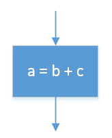

#Algorithms
----

##Links

1. [Online LMC](http://www.gcsecomputing.org.uk/lmc/index.html)
2. [LMC Explanation](http://www.yorku.ca/sychen/research/LMC/)
3. [PseudoCode CheatSheet](/cheatSheets/PseudoCode%20CheatSheet.pdf)
4. [PseudoWars](http://pseudowar.appjar.info)
5. [AQA PseudoCode Guidelines](http://filestore.aqa.org.uk/subjects/AQA-GCSE-COMPSCI-W-TRB-PSEU.PDF)

##LMC

Instructions | Mneumonic | Machine Code | Explanation
------------ | --------- | ------------ | ----------- 
Add | ADD | 1xx | Adds the contents of memory xx to the **ACCUMULATOR**.
Subtract | SUB | 2xx | Subtracts the contents of memory xx from the **ACCUMULATOR**.
Store | STA | 3xx | Copies the contents of the **ACCUMULATOR** to memory xx.
Load | LDA | 5xx | Copies the contents of memory xx to the **ACCUMULATOR**.
Branch ALWAYS | BRA | 6xx | Always set the program counter to xx. The program continues from the instruction at memory xx.
Branch if ZERO | BRZ | 7xx | Set the program counter to xx only of the **ACCUMULATOR** is zero.
Branch if POSITIVE | BRP | 8xx | Set the program counter to xx only if the **ACCUMULATOR** is zero or positive (greater than zero).
Input | INP | 901 | Copy the contents of the **INBOX** to the **ACCUMULATOR**.
Output | OUT | 902 | Copy the contents of the **ACCUMULATOR** to the **OUTBOX**.
Define Variable | **DAT** | | Reserves this memory slot as a variable, settinmg its contents to the value specified.
Halt | **HLT** | 000 | Halts execution of the program.

##Details

Topic | FlowChart | PseudoCode | Python | Machine Code | Assembler
----- | --------- | ---------- | ------ | ------------ | ---------
Assigning a variable |  | a &#8592; 5 | a=5 | a DAT 5 | 
Input |  | a &#8592; USERINPUT | a=input() | INP STA a | 901 3xx
Output |  | a &#8592; 5 | a=5 | LDA a OUT  | 5xx 902 
Addition |  | a &#8592; b + c | a=b+c | LDA b ADD c STA a | 5xx 1xx 3xx 
Subtraction |  | a &#8592; b - c | a=b-c | LDA b SUB c STA a | 5xx 2xx 3xx
Selection: Greater than |  | a &gt; b THEN funcA() ELSE funcB() | a &gt; b: funcA() else: funcB() | LDA b SUB a BRP funcA BRA funB | 5xx 2xx 8xx 6xx 
Selection: Less than |  | a &#8592; 5 | a=5 | a DAT 5 | 
Selection: Equal to |  | a &#8592; 5 | a=5 | a DAT 5 | 
Selection: Not equal to |  | a &#8592; 5 | a=5 | a DAT 5 | 
Iteration: While loop |  | a &#8592; 5 | a=5 | a DAT 5 | 
Iteration: For loop (count-up) |  | a &#8592; 5 | a=5 | a DAT 5 | 
Iteration: For loop (count-down) |  | a &#8592; 5 | a=5 | a DAT 5 | 

<table>

        <tr>
            <td valign="top">Selection: Less Than</td>
            <td valign="top">&nbsp;</td>
            <td valign="top">IF a &lt; b THEN &nbsp;&nbsp;&nbsp;&nbsp;funcA() ELSE &nbsp;&nbsp;&nbsp;&nbsp;funcB() ENDIF</td>
            <td valign="top"><pre style="background:#ffffff;color:#000000;">if a &lt; b: &nbsp;&nbsp;&nbsp;&nbsp;funcA() else: &nbsp;&nbsp;&nbsp;&nbsp;funcB()</pre></td>
            <td valign="top">LDA a SUB b BRP funcB BRA funcA</td>
            <td valign="top">5xx 2xx 8xx 6xx</td>
        </tr>

        <tr>
        <td valign="top">Selection: Equal To</td>
        <td valign="top">&nbsp;</td>
        <td valign="top">IF a = b THEN &nbsp;&nbsp;&nbsp;&nbsp;funcA() ELSE &nbsp;&nbsp;&nbsp;&nbsp;funcB() ENDIF</td>
        <td valign="top"><pre style="background:#ffffff;color:#000000;">if a == b: &nbsp;&nbsp;&nbsp;&nbsp;funcA() else: &nbsp;&nbsp;&nbsp;&nbsp;funcB()</pre></td>
        <td valign="top">LDA a SUB b BRZ funcA BRA funcB</td>
        <td valign="top">5xx 2xx 7xx 6xx</td>
        </tr>

        <tr>
            <td nowrap valign="top">Selection: Not Equal To</td>
            <td valign="top">&nbsp;</td>
            <td valign="top">IF a &#8800; b THEN &nbsp;&nbsp;&nbsp;&nbsp;funcA() ELSE &nbsp;&nbsp;&nbsp;&nbsp;funcB() ENDIF</td>
            <td valign="top"><pre style="background:#ffffff;color:#000000;">if a != b: &nbsp;&nbsp;&nbsp;&nbsp;funcA() else: &nbsp;&nbsp;&nbsp;&nbsp;funcB()</pre></td>
            <td valign="top">LDA a SUB b BRZ funcB BRA funcA</td>
            <td valign="top">5xx 2xx 7xx 6xx</td>
        </tr>

        <tr>
            <td valign="top">Iteration: While Loop</td>
            <td valign="top">&nbsp;</td>
            <td nowrap valign="top">WHILE a &#8800; b &nbsp;&nbsp;&nbsp;&nbsp;OUTPUT b &nbsp;&nbsp;&nbsp;&nbsp;a &#8592; USERINPUT ENDWHILE</td>
            <td valign="top"><pre style="background:#ffffff;color:#000000;">while a != b: &nbsp;&nbsp;&nbsp;&nbsp;print(b) &nbsp;&nbsp;&nbsp;&nbsp;a = input()</pre></td>
            <td valign="top">
                <table border="0" cellspacing="0" cellpadding="0">
                    <tbody>
                        <tr><td>while</td><td>LDA&nbsp;</td><td>a</td></tr>
                        <tr><td></td><td>SUB</td><td>b</td></tr>
                        <tr><td></td><td>BRZ</td><td>endwhile</td></tr>
                        <tr><td></td><td>LDA</td><td>b</td></tr>
                        <tr><td></td><td>OUT</td><td></td></tr>
                        <tr><td></td><td>INP</td><td></td></tr>
                        <tr><td></td><td>STA</td><td>a</td></tr>
                        <tr><td></td><td>BRA</td><td>while</td></tr>
                        <tr><td>endwhile&nbsp;</td><td><strong>HLT</strong></td><td></td></tr>
                        <tr><td>a</td><td>DAT</td><td>0</td></tr>
                        <tr><td>b</td><td>DAT</td><td>5</td></tr>
                    </tbody>
                </table>
            </td>

            <td valign="top">5xx 2xx 7xx 5xx 902 901 3xx 6xx 000</td>

        </tr>
        
        <tr>
            <td valign="top">Iteration: For Loop (count-up)</td>
            <td valign="top">&nbsp;</td>
            <td valign="top">FOR i &#8592; 0 TO 9 &nbsp;&nbsp;&nbsp;&nbsp;OUTPUT i ENDFOR</td>
            <td valign="top"><pre style="background:#ffffff;color:#000000;">for i in range(10): &nbsp;&nbsp;&nbsp;&nbsp;print(i)</pre></td>
            <td valign="top">
                <table border="0" cellspacing="0" cellpadding="0">
                    <tbody>
                        <tr>
                            <td>for&nbsp;</td>
                            <td>LDA&nbsp;</td>
                            <td>i</td>
                        </tr>
                        <tr>
                            <td>&nbsp;</td>
                            <td>OUT</td>
                            <td>&nbsp;</td>
                        </tr>
                        <tr>
                            <td>&nbsp;</td>
                            <td>ADD</td>
                            <td>one</td>
                        </tr>
                        <tr>
                            <td>&nbsp;</td>
                            <td>STA</td>
                            <td>i</td>
                        </tr>
                        <tr>
                            <td>&nbsp;</td>
                            <td>SUB</td>
                            <td>ten</td>
                        </tr>
                        <tr>
                            <td>&nbsp;</td>
                            <td>BRZ</td>
                            <td>endfor</td>
                        </tr>
                        <tr>
                            <td>&nbsp;</td>
                            <td>BRA</td>
                            <td>for</td>
                        </tr>
                        <tr>
                            <td>endfor&nbsp;</td>
                            <td><strong>HLT</strong></td>
                            <td>&nbsp;</td>
                        </tr>
                        <tr>
                            <td>i</td>
                            <td>DAT</td>
                            <td>0</td>
                        </tr>
                        <tr>
                            <td>one</td>
                            <td>DAT</td>
                            <td>1</td>
                        </tr>
                        <tr>
                            <td>ten</td>
                            <td>DAT</td>
                            <td>10</td>
                        </tr>
                    </tbody>
                </table>
            </td>
            <td valign="top">5xx 902 1xx 3xx 2xx 7xx 6xx 000</td>
        </tr>

        <tr>
            <td valign="top">Iteration: For Loop (count-down)</td>
            <td valign="top">&nbsp;</td>
            <td valign="top">FOR i &#8592; 10 TO 1 &nbsp;&nbsp;&nbsp;&nbsp;OUTPUT i ENDFOR</td>
            <td nowrap valign="top"><pre style="background:#ffffff;color:#000000;">for i in range(10, 0, -1): &nbsp;&nbsp;&nbsp;&nbsp;print(i)</pre></td>
            <td valign="top">
                <table border="0" cellspacing="0" cellpadding="0">
                    <tbody>
                        <tr><td>for&nbsp;</td><td>LDA&nbsp;</td><td>i</td></tr>
                        <tr><td>&nbsp;</td><td>OUT</td><td>&nbsp;</td></tr>
                        <tr><td>&nbsp;</td><td>SUB</td><td>one</td></tr>
                        <tr><td>&nbsp;</td><td>STA</td><td>i</td></tr>
                        <tr><td>&nbsp;</td><td>BRZ</td><td>endfor</td></tr>
                        <tr><td>&nbsp;</td><td>BRA</td><td>for</td></tr>
                        <tr><td>endfor&nbsp;</td><td><strong>HLT</strong></td><td>&nbsp;</td></tr>
                        <tr><td>i</td><td>DAT</td><td>10</td></tr><tr><td>one</td><td>DAT</td><td>1</td></tr>
                    </tbody>
                </table>
            </td>
        
            <td valign="top">
                <table border="0" cellspacing="0" cellpadding="0">
                    <tbody>
                        <tr><td>00&nbsp;&nbsp;&nbsp;&nbsp;</td><td>5xx&nbsp;&nbsp;&nbsp;&nbsp;</td><td>507</td></tr>
                        <tr><td>01</td><td>902</td><td>902</td></tr><tr><td>02</td><td>2xx</td><td>208</td></tr>
                        <tr><td>03</td><td>3xx</td><td>307</td></tr><tr><td>04</td><td>7xx</td><td>706</td></tr>
                        <tr><td>05</td><td>6xx</td><td>600</td></tr><tr><td>06</td><td>000</td><td>000</td></tr>
                        <tr><td>07</td><td></td><td>10</td></tr><tr><td>08</td><td></td><td>1</td></tr>
                    </tbody>
                </table>
            </td>
        </tr>
    </tbody>
</table>
