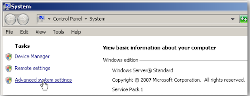
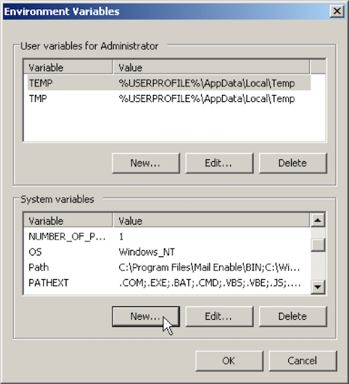
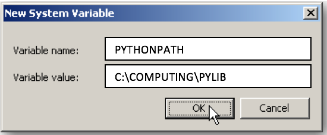
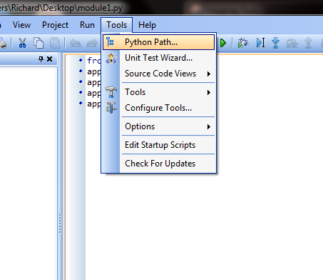
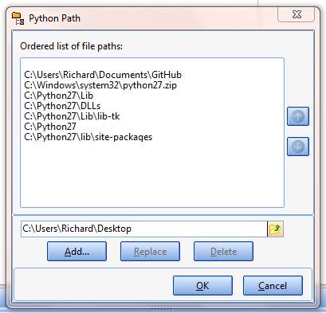
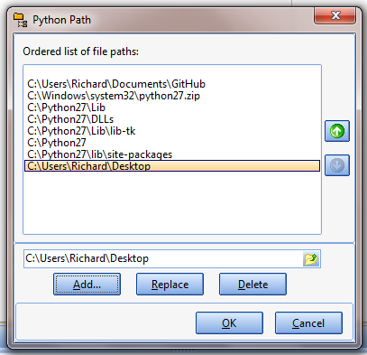

#Set-up Instructions
---
appJar was designed for use in schools - it therefore doesn't require any kind of special  *installation*.  
Instead, just [DOWNLOAD](https://github.com/jarvisteach/appJar/blob/appJar/releases/appJar.zip?raw=true) the ZIP file, unzip, and go - just put the folder in the [right place](#single-user-set-up).  

##Pip Installation  
However, if you can install python packages - we support that too!  

`sudo pip3 install appjar` - this will download & install **appJar** ready for python 3.  
`sudo pip3 install appjar --upgrade` - this will upgrade **appJar** to the latest version.  
```python
# import the appJar library
from appJar import gui
```

##Single-user Set-up  
If you can't/don't want to install using pip, simply:  

* [DOWNLOAD](https://github.com/RWBA/appJar/blob/appJar/releases/appJar.zip?raw=true) **appjar** and unzip it.  
* Put the **appJar folder** in your **code folder**, and you're done!  

```python
# import the appJar library
from appJar import gui
```
(As long as it's in the same folder as your code, it'll work...)  

### Linux
If you're on Linux you might be able to make this even simpler.  
You might have a `site-packages` folder, that is already in your path.  
In this case, put the `appJar` folder in `~/.local/lib/python3.x/site-packages/` where 3.x is the version of python that you use.  

##Multi-user Set-up  
---
If you're trying to install appJar in a school, everyone can download their own copy ([see above](#single-user-set-up)), or:  

* Put the **appJar folder** in a **shared location** (eg. a folder on a network drive): `E:\PYLIB`  
* Then have pupils include the following 2-lines at the start of their code:

```python
# add the appJar folder to your PATH
import sys
sys.path.append("E:\PYLIB")
# import the appJar library
from appJar import gui
```

##Advanced Set-up  
If you've got friendly technicians, you can even avoid having to always add **appJar** to your path...  

###Windows
----
Create an environment variable, which will mean `E:\PYLIB` is always in your **path**.  

* Open **Control Panel**  
* Navigate to **System -> Advanced System Settings**  

* Click the **Advanced** tab  

* Under **System variables**, click the **New..** button  

* Set the **Variable name:** to be **PYTHONPATH**  
* Set the **Variable value:** as the folder you put **appJar** in (eg. "E:\PYLIB")  

* Press **OK**, and you're done!    

---
<div style='text-align: center;'>
*Advertisement&nbsp;<sup>[why?](/advertising)</sup>*
<script async src="//pagead2.googlesyndication.com/pagead/js/adsbygoogle.js"></script>
<ins class="adsbygoogle"
    style="display:block"
    data-ad-format="fluid"
    data-ad-layout-key="-gw-13-4l+6+pt"
    data-ad-client="ca-pub-6185596049817878"
    data-ad-slot="5627392164"></ins>
<script>(adsbygoogle = window.adsbygoogle || []).push({});</script>
</div>
---

###Linux (Raspberry Pi) /MacOS 
---

If you're running python from a terminal:  

* Type the following:  
```bash
    echo 'export PYTHONPATH="${PYTHONPATH}:~/Documents/PYLIB"' >> ~/.bashrc
```
* Reopen the terminal (or type `source ~/.bashrc`), and you're done!  
* **NB.** Change `~/Documents/PYLIB` to the folder where the **appJar folder** is located.  

###IDLE on Linux (raspberry Pi)/MacOS  
----
If you're running python in  IDLE, you'll need to add appJar to your **site-packages**  

* Launch a **Terminal**  
* Type the following:  
```bash
    mkdir -p ~/Library/Python/3.4/lib/python/site-packages
    cd ~/Library/Python/3.4/lib/python/site-packages
    echo '~/Documents/PYLIB' > appJar.pth
```
* Close the terminal, and you're done!  
* **NB.** you'll need to make sure the version number (3.4) is correct.  
    * To check your version, run this in Python:  
```python
    import sys
    print(sys.version) 
```

## PyScripter  

If you're using [PyScripter](https://sourceforge.net/projects/pyscripter/) then follow the installation instructions above.  

If you're having problems appending to the path, you can try escaping the path:  

* `sys.path.append("E:\\PYLIB")` - putting double slashes might fix the issue.  

Alternatively, you can use the PyScripter menus:  

* Put appJar in a folder - in this case it's on the Desktop  

* Click **Tools** -> **Python Path...**  


* Either type or navigate to the folder containing appJar  


* Press **Add**, followed by **OK**  


**NB.** You will have to do this every time you run PyScripter, so it's better to get appJar installed properly if you can.  

## PortablePython

If you are using [PortablePython](http://portablepython.com/wiki/Download/) then you simply need to drop the appJar folder into the `Lib` folder of the PortablePython installation.  
