#Algorithms  
----  
Below are some comparisons of how to achieve the same thing in a flowchart, pseudocode & Python.  

This site was originally written using AQA suggested pseudocode, but will be updated to include OCR recommendations.  
It will aso be extended, to include a lot more examples.  

##Comparison  
Topic | FlowChart | PseudoCode | Python |
- | - | - | - 
Assigning a variable | 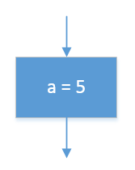 | a &#8592; 5 | a = 5 |
Input | 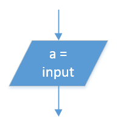 | a &#8592; USERINPUT | a = input() |
Output | 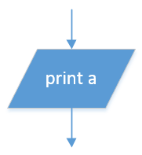 | OUTPUT a | print(a) |
Subtraction | 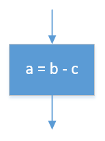 | a &#8592; b - c | a = b - c |
Selection: Greater than | 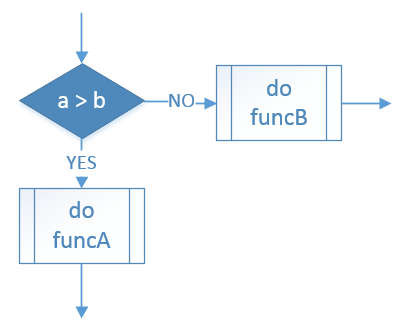 | IF a &gt; b THEN &emsp;funcA() ELSE &emsp;funcB() ENDIF | if a &gt; b: &emsp;funcA() else: &emsp;funcB() |
Selection: Less than | 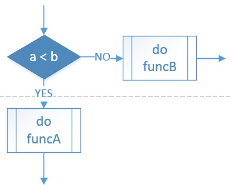 | IF a &lt; b THEN &emsp;funcA() ELSE &emsp;funcB() ENDIF | if a &lt; b: &emsp;funcA() else: &emsp;funcB() |
Selection: Equal to | 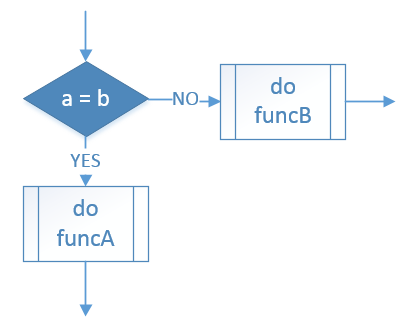 | IF a = b THEN &emsp;funcA() ELSE &emsp;funcB() ENDIF | if a == b: &emsp;funcA() else: &emsp;funcB() |
Selection: Not equal to | 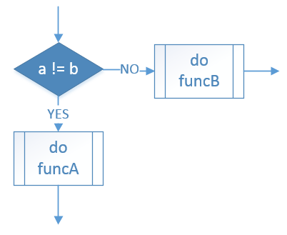 | IF a &#8800; b THEN &emsp;funcA() ELSE &emsp;funcB() ENDIF | if a != b: &emsp;funcA() else: &emsp;funcB() |
Iteration: While loop | 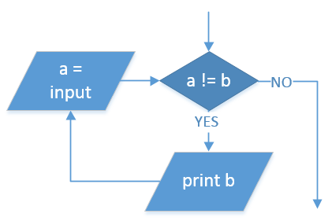 | WHILE a &#8800; b &emsp;OUTPUT b &emsp;a &#8592; USERINPUT ENDWHILE | while a != b: &emsp;print(b) &emsp;a = input() |
Iteration: For loop (count-up) | 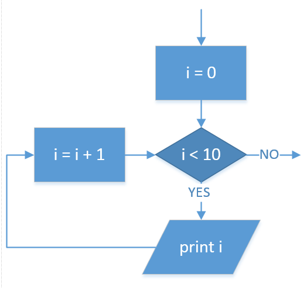 | FOR i &#8592; 0 TO 9 &emsp;OUTPUT i ENDFOR | for i in range(10): &emsp;print(i) |
Iteration: For loop (count-down) | 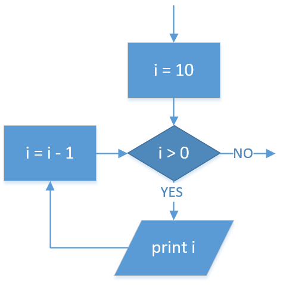 | FOR i &#8592; 10 TO 1 &emsp;OUTPUT i ENDFOR | for i in range(10, 0, -1): &emsp;print(i) |

##Links  
Some useful Pseudocode links.  

1. [PseudoCode CheatSheet](/cheatSheets/PseudoCode%20CheatSheet.pdf)
2. [PseudoWars](http://pseudowar.appjar.info)
3. [AQA PseudoCode Guidelines](http://filestore.aqa.org.uk/subjects/AQA-GCSE-COMPSCI-W-TRB-PSEU.PDF)
