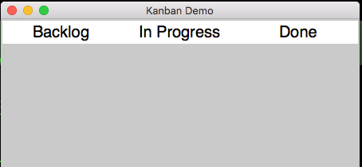
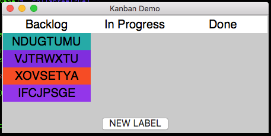

# Kanban Demo
---

A common interface is a **to-do list**, made up of multiple columns, with the ability to add items to the first column, then move items across the columns. We can create something similar in appJar by laying out labels in columns.

## The Layout
---

We'll start by creating the GUI with three labels across the top:

  


```python
from appJar import gui 

ttl = ('Backlog', 'In Progress', 'Done')

with gui("Kanban Demo", "450x200", bg='grey', sticky='new', font=20) as app:
    for pos in range(len(ttl)):
        app.label(ttl[pos], pos=(0, pos), bg='white', width=12, stretch='column')
```

Then, we'll add three empty frames and a button, underneath:
  

```python
from appJar import gui 
from random import choice

ttl = ('Backlog', 'In Progress', 'Done')

def genNewLbl():
    with app.frame(ttl[0]):
        text = ''.join(choice('ABCDEFGHIJKLMNOPQRSTUVWXYZ') for c in range(8))
        app.label(text, bg=app.getRandomColour())

with gui("Kanban Demo", "450x200", bg='grey', sticky='new', font=20) as app:
    for pos in range(len(ttl)):
        app.label(ttl[pos], pos=(0, pos), bg='white', width=12, stretch='column')
        app.stretch = 'both'
        with app.frame(ttl[pos], row=1, column=pos, sticky='new'): pass

    app.button("NEW LABEL", genNewLbl, colspan=3, sticky='s', stretch='column', font=16)
```

## Moving the Labels
---

Next we need to make the labels interactive, so that when they are clicked, they are moved to the next column.  

We'll define a function to move a label to the named frame:

```python
def move(lName, fName):
    # move the label to the new frame
    with app.frame(fName): app.moveLabel(lName)
```

Now, we just need some way for each label to know it's destination frame.  

We'll create three wrapper functions to do this:

```python
def move1(lName): move(lName, ttl[1])
def move2(lName): move(lName, ttl[2])
def trash(lName): app.removeLabel(lName)
```

Then, we update the function that generates labels to give each one a `submit` function, that moves it to the next column:  

```python
def genNewLbl():
    with app.frame(ttl[0]):
        text = ''.join(choice('ABCDEFGHIJKLMNOPQRSTUVWXYZ') for c in range(8))
        app.label(text, bg=app.getRandomColour(), submit=move1) # add submit function
```

And update the move function so that it changes a label's `submit` function when it is moved:

```python
def move(lName, fName):
    # move the label to the new frame
    with app.frame(fName): app.moveLabel(lName)
    # change the label's submit function
    if fName == ttl[1]: app.label(lName, submit=move2)
    else: app.label(lName, submit=trash)
```

And that's it, we have a way of moving tasks from one column to the next...
