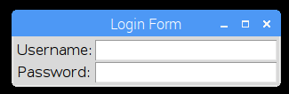
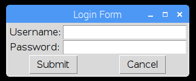
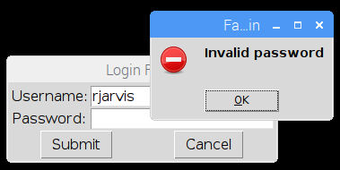

# Simple Examples  
----  
## Login Form

#### Start off by importing the library and creating the gui  

```python
    from appJar import gui

    # create the GUI & set a title
    app = gui("Login Form")

    # add labels & entries
    # in the correct row & column
    app.addLabel("userLab", "Username:", 0, 0)
    app.addEntry("userEnt", 0, 1)
    app.addLabel("passLab", "Password:", 1, 0)
    app.addEntry("passEnt", 1, 1)

    # start the GUI
    app.go()
```

#### Next, add some buttons  

```python
    # these buttons call a *None* function - they don't do anything
    app.addButtons( ["Submit", "Cancel"], None, colspan=2)
```

#### Then give the buttons a function to call
```python
    # function to print out the name of the button pressed
    # followed by the contents of the two entry boxes
    def press(btnName):
        print(btnName)
        print app.getEntry("userEnt")
        print app.getEntry("passEnt")

    # changed this line to call a function
    app.addButtons( ["Submit", "Cancel"], press, colspan=2)
```    

#### Finally, program some logic into the function
```python
def press(btnName):
    if btnName == "Cancel":
        app.stop()

    if app.getEntry("userEnt") == "rjarvis":
        if app.getEntry("passEnt") == "abc":
            app.infoBox("Success", "Congratulations, you are logged in!")
        else:
            app.errorBox("Failed login", "Invalid password")
    else:
        app.errorBox("Failed login", "Invalid username")
```

#### Extension - add some enhancements
```python
    app.addSecretEntry("passEnt", 1, 1)
    app.setFocus("userEnt")
    app.enableEnter(press)
```


* [Full source code](src/login.py)
