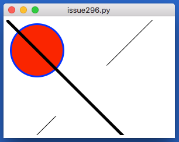
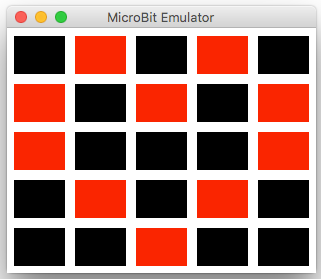
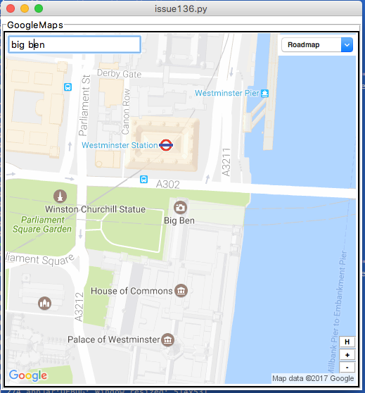
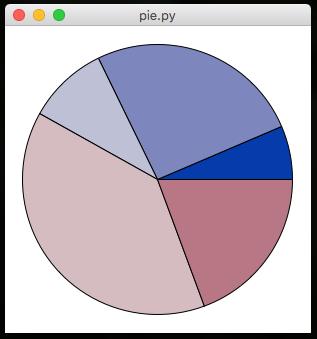
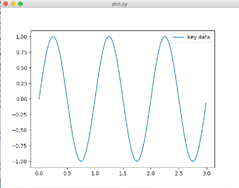

# Output Widgets
----
In a GUI, the fillings are known as **widgets**. There are lots of different widgets to choose from, each suited to a specific task - we've grouped them into [output widgets](#) & [input widgets](/inputWidgets).  

Output widgets are used for displaying information to a user.  

They usually provide three functions:  

* **ADD** - this creates the widget
* **GET** - this gets the contents of the widget  
* **SET** - this changes the contents of the widget  

As well as options to change the way they [look/act](pythonWidgetOptions.md).

For each of the above to work, we need to know which widget you are referring to - so every widget gets a **unique title**.

## Label
---
*Labels* are used for displaying text in the GUI.  

* They are great for titles, at the top of the GUI, usually spanning multiple columns.  
* They are really useful before *Entries* and *Drop-downs* to explain their purpose.  
* And, they're very helpful at the bottom of the GUI, to show the results of an action.  
  
```python
from appJar import gui

app = gui()

app.addLabel("l1", "Label 1")
app.addLabel("l2", "Label 2")
app.addLabel("l3", "Label 3")
app.addLabel("l4", "Label 4")
# common set functions
app.setLabelBg("l1", "red")
app.setLabelBg("l2", "yellow")
app.setLabelBg("l3", "purple")
app.setLabelBg("l4", "orange")

app.go()
```

#### Add Labels
* `.addLabel(title, text=None)`  
    This will create a label widget to display text in the GUI.  
    The `title` is used to uniquely identify the label, in case you want to change it later, and the `text` is what gets displayed.  
    If `text` is set to None, or no `text` is provided, the `title` will be displayed in the label.  

* `.addEmptyLabel(title)`  
    Does the same as add a *label*, except there's no parameter to set any text.

* `.addSelectableLabel(title, text=None)`  
    This adds a label whose text can be selected with the mouse.  
    This is really just a *read-only* Entry, disguised to look like a label.  
    But it seems to do the trick...  

* `.addFlashLabel(title, text=None)`  
    This adds a flashing *label*, that will alternate between the foreground and background colours.

  
```python
from appJar import gui

app = gui()

app.addFlashLabel("f1", "This is flashing")
app.addLabel("f2", "This is not flashing")
app.addFlashLabel("f3", "This is also flashing")

app.go()
```

#### Set Labels
* `.setLabel(title, text)`  
    Change the contents of the *label*.

* `.clearLabel(title)`  
    Clear the contents of the *label*.

#### Get Labels
* `.getLabel(title)`  
    Get the contents of the *label*.

#### Auto-Labelled Widgets

It's possible to automatically include a *label* alongside a lot of the  widgets.  
Both the label and widget will be placed in the same grid space.  
Simply add the word `Label` to the command when adding the widget:  

* `.addLabelEntry(title)`
* `.addLabelNumericEntry(title)`
* `.addLabelSecretEntry(title)`
* `.addLabelAutoEntry(title, words)`
* `.addLabelScale(title)`
* `.addLabelOptionBox(title, values)`
* `.addLabelTickOptionBox(title, values)`
* `.addLabelSpinBox(title, values)`
* `.addLabelSpinBoxRange(title, from, to)`  

See the relevant section for a description of what the widget does.

## Message
____
Very similar to a Label, except it will wrap the text over multiple lines.  
By default the text is laid out 50% wider than it is high.  
This can be changed by setting a specific `width` or by changing the `aspect` ratio.  

  

```python
from appJar import gui

app=gui()
app.setFont(12)
app.addMessage("mess", """You can put a lot of text in this widget.
The text will be wrapped over multiple lines.
It's not possible to apply different styles to different words.""")
app.go()
```

#### Add Messages
* `.addMessage(title, text)`  
    Adds a Message widget, with the specified text.  
    If not text is provided, the title will be used for the text.  

* `.addEmptyMessage(title)`  
    Adds an empty Message widget.  

#### Set Messages
* `.clearMessage(title)`  
    Clears the specified Message widget.  

* `.setMessage(title, text)`  
    Sets the contents of the specified Message widget, to the specified text.  

* `.setMessageAspect(title, aspect)`  
    Sets the aspect ratio at which text is wrapped.  
    The default is 150, which means the text will be 50% wider than it is high.  
    Ignored if a `width` has been set.  

* `.setMessageWidth(title, width)`  
    Sets the number of characters per line for the widget.  
    If not set, width is calculated using the default aspect ratio.  

## Meter  
---

Various styles of progress meter:  

* #### Meter  

      
    A simple meter for showing progress from 0% to 100%.  

* #### SplitMeter  

      
    A possession style meter, showing percentages on either side.  

* #### DualMeter  

      
    Two separate meters, expanding out from the middle.  

```python
from appJar import gui

app=gui()
app.addMeter("progress")
app.setMeterFill("progress", "blue")
app.go()
```

#### Add Meters
* `.addMeter(name)` & `.addSplitMeter(name)` &  `.addDualMeter(name)`  
    Adds a meter with the specified name, of the specified type.  
#### Set Meters
* `.setMeter(name, value, text=None)`  
    Changes the specified meter to the specified value.  
    For `Meter` & `SplitMeter`should be a value between 0 and 100.  
    For `DualMeter` should be a list of two values, each between 0 and 100.  

* `.setMeterFill(name, colour)`  
    Changes the fill colour of the specified meter.  
    For `SplitMeter` & `DualMeter`should be a list of two colours.  

#### Get Meters

* `.getMeter(name)`  
    Gets the value of the specified meter.  
    As meters convert their data to a value between 0 and 1, this will return a list of two values: `(0.45, '45 %')`  

* `.getAllMeters()`  
    This will return the contents of all Meters in the app, as a dictionary.  

#### Background Processing  
Meters are designed to show progress over time.  
One common solution is to register a function that is constantly updating a meter.  
This should then be monitoring/updating a global variable:  

```python
def updateMeter():
    app.setMeter("progress", percentComplete)

# schedule function to be called regularly
app.registerEvent(updateMeter)
```

## Separator
____
Useful for indicating separation between widgets.  
Will draw a horizontal/vertical line spanning the cell.  
  

```python
from appJar import gui

app=gui()
app.setBg("lightBlue")
app.addHorizontalSeparator(0,0,4, colour="red")
app.addVerticalSeparator(1,0, colour="red")
app.addVerticalSeparator(1,1, colour="red")
app.addVerticalSeparator(1,2, colour="red")
app.addVerticalSeparator(1,3, colour="red")
app.addHorizontalSeparator(2,0,4, colour="red")
app.go()
```

#### Add Seperators

* `.addHorizontalSeparator(colour=None)` & `.addVerticalSeparator(colour=None)`  
    Adds a separator (a horizontal or vertical line) spanning the cell.  
    An optional colour can be passed in, to set a colour for the separator.  

## Grip
____
Clickable icon to drag the window around.  

  

```python
from appJar import gui

app=gui()
app.setFont(20)
app.setBg("lightBlue")

app.addLabel("l1", "Move me around...", 0, 0)
app.addGrip(0,1)
app.addSeparator(1,0,2, colour="red")
app.go()
```
#### Add Grips

* `.addGrip()`  
    Adds a simple grip icon.  
    The mouse pointer changes over the grip, and a ToolTip will be shown.  
    The size and image can't be changed.  

## Canvas
---
This lets you embed a canvas in appJar.  
Canvases are very powerful, appJar will never provide wrappers for all their functions.  
So, if you're looking to truly harness a canvas, add it and save the widget as a variable: `canvas = app.addCanvas("c1")`. Then, you can call all the canvas functions as you would a tKinter canvas.

  

```python
from appJar import gui
app=gui()
app.addCanvas("c1")
app.addCanvasOval("c1", 10, 10, 100, 100, fill="red", outline="blue", width=3)
app.addCanvasLine("c1", 0, 0, 255, 255, width=5)
app.addCanvasLine("c1", 0, 255, 255, 0, dash=123)
app.go()
```

Or, as mentioned above, you can work directly with the canvas object:  

```python
from appJar import gui
app=gui()
canvas = app.addCanvas("c1")
canvas.create_oval(10, 10, 100, 100, fill="red", outline="blue", width=3)
canvas.create_line(0, 0, 255, 255, width=5)
canvas.create_line(0, 255, 255, 0, dash=123)
app.go()
```

* `.addCanvas(title)`  
    Creates a canvas widget.  

* `.getCanvas(title)`  
    Gets the specified canvas widget.  

#### Setting a Canvas  

* `.setCanvasMap(title, func, coords)`  
    It is possible to set up a simple CanvasMap - a clickable canvas, with names linked to different areas.
    When one of those areas is clicked, a function will be called, passing the name of the area as a parameter.
    `coords` must contain a dictionary of areas on the map.
    When a position on the canavs is clicked, in one of the areas, the named function will be called, passing in the area's name.
    When an unknown position on the canavs is clicked, UNKNOWN will be passed to the function, along with the coordinates.

#### Drawing on a Canvas  

**NB.** each of these functions returns the object being created, so you can later change it:

```python
canvas = app.addCanvas("c1")
rect = app.addCanvasRectangle("c1", x=40, y=80, w=100, h=100, fill='green')
canvas.itemconfig(rect, fill='pink')
```

* `.addCanvasCircle(title, x, y, diameter, **kwargs)`  
    Draws a circle on the canvas.  

* `.addCanvasOval(title, x, y, xDiam, yDiam, **kwargs)`  
    Draws an oval on the canvas.  

* `.addCanvasRectangle(title, x, y, w, h, **kwargs)`  
    Draws a rectangle on the canvas.  

* `.addCanvasLine(title, x, y, x2, y2, **kwargs)`  
    Draws a line on the canvas.  

* `.addCanvasText(title, x, y, text, **kwargs)`  
    Draws text on the canvas.  

* `.addCanvasImage(title, x, y, image, **kwargs)`  
    Draws the specified image on the canvas.  

* `.clearCanvas(title)`  
    Removes all items from the canvas.  

## Turtle
---
This lets you embed a [turtle](https://docs.python.org/3.6/library/turtle.html) widget in appJar.  

  

```python
from appJar import gui 

def press(b):
    s = app.getTurtleScreen("t1")
    t = app.getTurtle("t1")
    s.bgcolor("blue")
    t.pencolor("white")
    for i in range(20):
        t.forward(i * 10) 
        t.right(144)

app=gui()
app.addTurtle("t1")
app.addButton("DRAW", press)
app.go()
```

* `.addTurtle(title)`  
    Creates a turtle widget.  

* `.getTurtle(title)`  
    Gets the specified turtle widget.  

* `.getTurtleScreen(title)`  
    Gets the screen behind the turtle widget.  

## MicroBit Emulator  
---  
Widget to emulate a [MicroBit](http://microbit.org)



```python
from appJar import gui

app = gui()
app.addMicroBit("mb1")
app.setMicroBitImage("mb1", "09090:90909:90009:09090:00900")
app.go()
```

#### Add MicroBits
* ```.addMicroBit(title)```  
    Will create a 5x5 grid emulating the MicroBit LEDs.  

#### Set MicroBits
* ```.setMicroBitImage(title, image)```  
    This sets each pixel to the specified brightness (0 to 9).  
    Each set of 5 digits represents a row of pixels, from top to bottom.  

* ```.setMicroBitPixel(title, x, y, brightness)```  
    Will set the brightness of the specified pixel.  
    ```x``` & ```y``` should be between 0 & 4.  
    ```brightness``` should be a value between 0 & 9 to represent how **bright** to make the pixel.  

* ```.clearMicroBit(title)```  
    Will turn off all of the pixels - setting their brightness to 0.  

## GoogleMaps
---
A self-contained GoogleMaps widget.  
It provides useful functionality for finding somewhere on Earth.  
All requests for map data are performed in the background, so the UI shouldn't become unresponsive.  



```python
from appjar import gui

app = gui()
app.addGoogleMap("m1")
app.setGoogleMapSize("m1", "300x500")
app.go()
```

#### Add GoogleMaps  

* `.addGoogleMap(title)`  
    Creates a GoogleMap widget.  
    Displays a map image, and provides functionality to search, zoom, and change terrain, as well as a link to the original image.  

#### Set GoogleMaps  

* `.searchGoogleMap(title, location)`  
    Update the named GoogleMap widget to show the specified location.  

* `.zoomGoogleMap(title, mod)`  
    Change the zoom level of the named GoogleMap.  
    Providing a **+** or **-** will cause the map to zoom in or out one level.  
    Otherwise, a digit between 0 and 22 should be provided, to set the zoom level.  

* `.setGoogleMapTerrain(title, terrain)`  

* `.setGoogleMapSize(title, size)`  
    Set the size of the GoogleMap. Should be in the format `"300x300"`.  
    Note, if you set it too small, the control widgets won't look good...  

* `.setGoogleMapMarker(title, location, size=None, colour=None, label=None, replace=False)`  
    Will drop a marker on the specified location.  
    The marker will only be visible if the current `location` & `zoom level` permit.  
    If an empty `location` is provided, all markers will be removed.  
    `colour` can be set to any of (black, brown, green, purple, yellow, blue, gray, orange, red, white) or a hex value (starting '0x').  
    `size` can be set to any of (tiny, mid, small).  
    `label` can be set to a single letter or digit.  
    If `replace` is `True` this marker will replace the last one added.  

* `.removeGoogleMapMarker(title, label)`  
    Will remove the specified marker, if found.  

#### Get GoogleMaps  

* `.getGoogleMapLocation(title)`  
    Returns the current displayed location.  
    Will return an empty String, if the user clicked the **H** button.  

* `.getGoogleMapZoom(title)`  
    Returns the current zoom level of the map tile.  

* `.getGoogleMapTerrain(title)`  
    Returns the current terrain setting for the map tile.  

* `.getGoogleMapSize(title)`  
    Returns the current size of the map tile.  

#### Save GoogleMaps  

* `.saveGoogleMap(title, fileName)`  
    Saves the currently displayed map to the named location.  
    By default, all map tiles are GIFs.  

## PieChart
---
Widget to depict a Pie Chart.  
It will automatically calculate percentages, and draw a pie chart, given a dictionary of items and their amount.  
The PieChart is purely for display purposes, and is not interactive, other than a simple mouse-over effect with a tooltip.  
  

```python
from appJar import gui

app = gui()
app.addPieChart("p1", {"apples":50, "oranges":200, "grapes":75,
                        "beef":300, "turkey":150})
app.go()
```

#### Add PieCharts  
* `.addPieChart(title, values)`  
    Takes a dictionary of names and values, which will be converted to percentages, and plotted on the chart.  
    The names will be used as part of tooltips that appear over each wedge of the PieChart.  

#### Set PieCharts  
* `.setPieChart(title, name, value)`  
    Will update the PieChart, by either changing an existing value, adding a new value, or removing a value if it's set to 0.  

## MatPlotLib
---

Support for embedding very basic [MatPlotLib](http://matplotlib.org) plots.  

  
```python
from numpy import sin, pi, arange
from appJar import gui 
import random

def getXY():
    x = arange(0.0, 3.0, 0.01)
    y = sin(random.randint(1,10) * pi * x)
    return x,y 
    
def generate(btn):
    # *getXY() will unpack the two return values
    # and pass them as separate parameters
    app.updatePlot("p1", *getXY())
    showLabels()
    
def showLabels():
    axes.legend(['The curve'])
    axes.set_xlabel("X Axes")
    axes.set_ylabel("Y Axes")
    app.refreshPlot("p1")
    
app = gui()
axes = app.addPlot("p1", *getXY())
showLabels()
app.addButton("Generate", generate)
app.go()
```

* `.addPlot(title, x, y)`  
    Create a plot with the specified x and y values.  
    Returns the plot object, to allow further customisation.  

* `.addPlotFig(title)`  
    Create an empty Figure, so that you can add your own plots.  
    Returns the figure object, to allow further customisation.  

```python
from appJar import gui 
from mpl_toolkits.mplot3d import Axes3D

with gui() as app:
    fig = app.addPlotFig("p1")
    ax = fig.add_subplot(111, projection='3d')
    ax.scatter([1,2],[1,2],[1,2])
```

* `.updatePlot(title, x, y, keepLabels=False)`  
    Update the specified plot with the specified x and y values.  
    **NB.** if you do this you will lose any customisations applied to the axes.  
    If you set `keepLabels` to True, then the axis labels & title will be retained.  
    Also, your app will crash, if you call this after `.addPlotFig()`  

* `.refreshPlot(title)`  
    Call this any time you modify the axes.  
