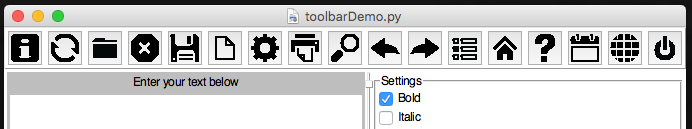
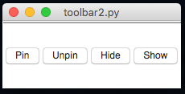
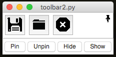
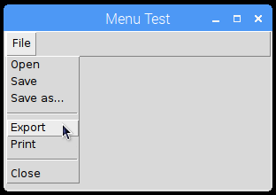
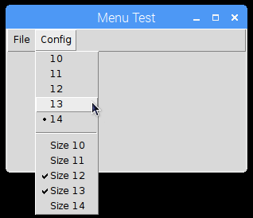
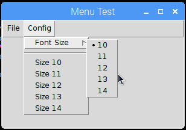
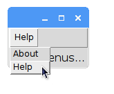
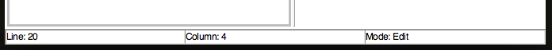
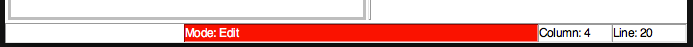

#Toolbars, Menubars & Statusbars
----
Toolbars and Menubars are features common to most GUIs, you'll be used to seeing them along the top of apps, such as MS Word.  
Statusbars are also useful features, they allow you to show information about what's going on in a GUI, usually along the bottom of the app.  

##Toolbar
___
Toolbars (sometimes known as ribbons) appear across the top of a GUI.  
They offer a series of buttons to click, which can be used to change settings/functionality in a GUI.

**NB.** Icons don't work in python 2.7, due to an issue showing PNG images.  

  

```python
tools = ["ABOUT", "REFRESH", "OPEN", "CLOSE", "SAVE",
        "NEW", "SETTINGS", "PRINT", "SEARCH", "UNDO",
        "REDO", "PREFERENCES", "HOME", "HELP", "CALENDAR",
        "WEB", "OFF"]

app.addToolbar(tools, tbFunc, findIcon=True)
```

####Create Toolbars

* `.addToolbar(names, funcs, findIcon=False)`  
    Will add a list of buttons along the top, in a toolbar. Each button will call the corresponding function.  
    If only one function is supplied, they will all call the same function, providing the button's name as a parameter.  
    A set of icons is available, if `findIcon` is set to True, then appJar will attempt to find an icon for each button.  

* `.addToolbarButton(name, func, findIcon=False)`  
    Adds a single button to the toolbar - see above.  

####Set Toolbars

* `.setToolbarPinned(pinned=True)`  
    Will configure the toolbar to be *pinnable*  
    When the mouse is not over the toolbar it will minimise.  



The toolbar will also gain an extra button (a pin) allowing the user to configure it to be pinned or not.  

  

* `.setToolbarIcon(name, icon)`  
    Will set an icon for the corresponding button in the toolbar.  
    Use the name of any of the icons in the resource folder (without the folder or file extension).  

* `.setToolbarImage(name, image)`  
    Will set an image for the corresponding button in the toolbar.  

* `.setToolbarEnabled()` & `.setToolbarDisabled()`  
    Will enable/disable all buttons on the toolbar.  

* `.setToolbarButtonEnabled(name)` & `.setToolbarButtonDisabled(name)`  
    Will enable/disable the named toolbar button.  

* `.showToolbar()` & `.hideToolbar()`  
    Will show/hide the toolbar.  

* `.removeToolbarButton(name, hide=True)`  
    Will remove the named button from the toolbar.  
    The toolbar will be hidden when there are no buttons on it, unless `hide` is set to False.  

* `.removeToolbar(hide=True)`  
    Will remove all buttons from the toolbar.  
    The empty toolbar will be hidden, unless `hide` is set to False.  

---
<div style='text-align: center;'>
*Advertisement&nbsp;<sup>[why?](/advertising)</sup>*
<script async src="//pagead2.googlesyndication.com/pagead/js/adsbygoogle.js"></script>
<ins class="adsbygoogle"
    style="display:block"
    data-ad-format="fluid"
    data-ad-layout-key="-gw-13-4l+6+pt"
    data-ad-client="ca-pub-6185596049817878"
    data-ad-slot="5627392164"></ins>
<script>(adsbygoogle = window.adsbygoogle || []).push({});</script>
</div>
---

##Menubar
---
Adds a standard Menubar along the top of the GUI.  
On Windows/Linux a menubar will only be shown, once the first menu has been added.  
On Mac, a menubar is always present.  
Menubars are made up of a series of menus, each containing a list of names.  
These names can be menu-items, radio buttons, check boxes, separators, or sub-menus.  

####Create Menus

* `.addMenuList(menu, names, functions)`  
    Will create a new menu, with the specified title, containing the list of names.  
    Pass a single function - all names will call that function, passing their name.  
    Or a list of functions (the same length as the names), each menu will call the corresponding function.  
    If a name is ```-```, then a separator will be added to the menu.  

    
```python
fileMenus = ["Open", "Save", "Save as...", "-", "Export", "Print", "-", "Close"]
app.addMenuList("File", fileMenus, menuPress)
```

* `.createMenu(menu, tearable=False)`  
    Will create a new, empty menu, to add menu-items to.

* `.addMenuItem(menu, name, func=None, shortcut=None, underline=-1)`  
    Add a menu-item to the named menu, with the specified function.  
    If the named menu does not exist, it will be automatically created.  
    If the name is ```-```, then a separator will be added to the menu.  

* `.addMenuSeparator(menu)`  
    Add a separator to the named menu.  

* `.addMenuCheckBox(menu, name, function=None, shortcut=None, underline=-1)`  
    Add a check box, to the named menu, with the specified name.  

* `.addMenuRadioButton(menu, name, value, function=None, shortcut=None, underline=-1)`  
    Add a radio button, to the named menu, grouped by name, with the specified value.  


```python
app.createMenu("Config")

for i in range(5):
    app.addMenuRadioButton("Config", "font", "1" + str(i), menuPress)

app.addMenuSeparator("Config")

for i in range(5):
    app.addMenuCheckBox("Config", "Size 1" + str(i), menuPress)
```

* `.addSubMenu(menu, subMenu)`  
    Adds a sub-menu to the specified menu.  
    Then add menu-items to this menu (using its name).  


```python
app.createMenu("Config")
app.addSubMenu("Config", "Font Size")
for i in range(5):
    app.addMenuRadioButton("Font Size", "font", "1" + str(i), menuPress)

```

* `.addMenu(menu, function, shortcut=None, underline=-1)`  
    Adds a single menu, with no list of menu-items,  that will call the specified function.  

####Set Menus

* `.setMenuCheckBox(menu, name)`  
    Inverts the specified check box, in the named menu.

* `.setMenuRadioButton(menu, name, value)`  
    Selects the specified value, of the specified radio button, in the named menu.

* `.setMenuImage(menu, name, image, align='text')`  
    Will set the specified image for the specified menu-item.  

* `.setMenuIcon(menu, name, icon, align='text')`  
    Will set the specified icon for the specified menu-item.  

* `.disableMenuItem(menu, name)` & `.enableMenuItem(menu, name)`  
    Will enable/disable the specified menu name.  

* `.disableMenu(menu)` & `.enableMenu(menu)`  
    Will disable/enable the specified menu.  

* `.disableMenubar()` & `.enableMenubar()`  
    Will disable/enable all menus.  
    NB. currently doesn't disable entries in default Mac menus.  

####Get Menus

* `.getMenuCheckBox(menu, name)`  
    Get the value of the specified check box, from the named menu.  
    Returns True or False.  

* `.getMenuRadioButton(menu, name)`  
    Get the value of the specified radio button, from the named menu.  
    Returns the name of the checked radio button, for this group.  

----

####Extra Features:  

* `shortcut` These are keyboard shortcuts to call a menu-item.  
    These should always be a combination of *special keys* and a *regular key*, separated by dashes.  
    e.g. `"Control-s"` or `"Control-Shift-z"`  
    The following *special keys* are available: `Control`, `Option`, `Alt`, `Shift`, `Command`, `Meta`  

* `underline` If set to an Integer, the corresponding character will be underlined.  

* `tearable` If this is set to True, it's possible to undock the menu.  

---

####Platform Specific/Custom Menus
It's possible to interact with menus that are specific to particular platforms, or prebuilt for specific purposes.  
Simply use the menu names given below when adding menu-items to a menu.  

* **Generic**  
    * **Right-click Menu**  
        Call `.createRightClickMenu(menu, showInBar=False)` to create an empty **right-click menu**   
        If ```showInBar``` is set to ```True```, the Menu will also appear in the topLevel Menubar.  
        The right-click menu can be populated the same way as a regular menu.  

        To link the **right-click menu** to a widget, call ```.setXXXRightClick(widgetName, menu)```  

    * **Edit Menu** - `EDIT` provides a right-click, *cut & paste* menu automatically linked to all **text**, **entry** & **option boxes**.  
        Call `.addMenuEdit(inMenuBar=False)` to enable the *Edit* menu.  
        Set the parameter to True, to also show it in the menu bar.  
        This menu does its best to show the appropriate options, for all situations - but doesn't know when you can't *redo* an action.  

* **Windows**  
    * **System Menu** - `WIN_SYS` accessed by clicking the icon in the top left corner of the GUI.  

* **Mac** - there are three *default* menus, each containing platform specific menus-item.   
    There are also a couple of menu-items the user can/should provide.  
    * **Application Menu** - `MAC_APP` after the Apple logo (), usually called *Python*.  
        This menu is always present, and cannot be renamed - no matter how much I wish it could!  
        Call `.addMenuPreferences(function)` to enable the *Preferences* menu-item, within the *Application Menu*.  
    * **Window Menu** - `MAC_WIN` contains menu-items related to windows.   
        To access this menu, you must first call `.addMenuWindow()`  
    * **Help Menu** - `MAC_HELP` provides a *Search* menu-item   
        To access this menu, you must first call `.addMenuHelp(function)`, passing the function to call for the default *Python Help* menu-item.  

* **Linux** - by default, there is no menu, but it's easy enough to get access to the appJar menus:

  

```python
app.addMenuItem("appJar", "Help", app.appJarHelp)
app.addMenuItem("appJar", "About", app.appJarAbout)
```

##Statusbar
___
Adds a statusbar along the bottom of the GUI.
This can be used for easy debugging, as info for the user, or to show current settings.  

  

```python
app.addStatusbar(fields=3)
app.setStatusbar("Line: 20", 0)
app.setStatusbar("Column: 4", 1)
app.setStatusbar("Mode: Edit", 2)
```

  

```python
app.addToolbar(tools, tbFunc, True)
app.addStatusbar(fields=3, side="RIGHT")
# NOTE: 0 is now on the right
app.setStatusbarWidth(50, 2)
app.setStatusbarBg("red", 2)
app.setStatusbarFg("white", 2)
```

####Create Statusbars  

* `.addStatusbar(header="", fields=1, side=None)`  
    This turns the statusbar on, and if a header is supplied, will prepend the header before every status.  
    If ```fields``` is populated, it's possible to have multiple status boxes, each addressable by a number.  
    ```side``` can be set as LEFT/RIGHT to make the fields appear from the left or right side, otherwise they will stretch equally.  

####Set Statusbars  
* `.setStatusbar(text, field=0)`  
    This updates the contents of the statusbar.  
    Again, if a header was set when adding the statusbar, it will be prepended to the message.  
    If multiple fields were created, a position should be supplied to populate (starting from 0).  

* `.clearStatusbar(field=0)`  
    Clear anything displayed in the statusbar, along with any header that might be set.  
    If multiple fields were created, specify which one, otherwise all fields will be cleared.  

* `.setStatusbarWidth(width, field=0)`  
    Set the width of the specified statusbar field (in characters).  

* `.setStatusbarHeader(header)`  
    Set a new header value to be used from the next time the statusbar text is updated.  

* `.removeStatusbarField(field)`  
    Remove the field at the specified position from the the statusbar.  

* `.removeStatusbar()`  
    Removes the statusbar from the GUI.  

