#Pop-ups
---
A number of pop-ups (aka dialogs) are available, to add a different user experience, notify the user of information, or get one off pieces of data.

### Tooltips
---
* `.set XXX Tooltip(name, value)`  
    Sets a tooltip for the named widget, with the specified value.  
    The specified value will be displayed in a small pop-up, when the mouse is left over the widget.

    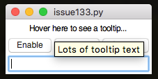

    If called a second time, it will update the value of the tooltip.  
    NB. `XXX` must be the widget type, eg. `Label`  

* `.enable XXX Tooltip(name)` & `.disable XXX Tooltip(name)`  
    These will enable or disable the named tooltip.  
    When disabled, it will not show-up.  

---
<div style='text-align: center;'>
*Advertisement&nbsp;<sup><a href="/advertising">why?</a></sup>*
<script async src="//pagead2.googlesyndication.com/pagead/js/adsbygoogle.js"></script>
<ins class="adsbygoogle"
    style="display:block"
    data-ad-format="fluid"
    data-ad-layout-key="-gw-13-4l+6+pt"
    data-ad-client="ca-pub-6185596049817878"
    data-ad-slot="5627392164"></ins>
<script>(adsbygoogle = window.adsbygoogle || []).push({});</script>
</div>
---

### Message Boxes
---
* `.infoBox(title, message, parent=None)`  
    Shows a simple information message, with an OK button.  
    If this dialog is being launched from a [subWindow](/pythonWidgetGrouping/#sub-window) set `parent` to be the name of the subWindow.  
    

* `.errorBox(title, message, parent=None)`  
    Shows a simple error message, with an OK button.  
    If this dialog is being launched from a [subWindow](/pythonWidgetGrouping/#sub-window) set `parent` to be the name of the subWindow.  
    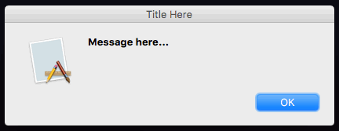

* `.warningBox(title, message, parent=None)`  
    Shows a simple warning message, with an OK message.  
    If this dialog is being launched from a [subWindow](/pythonWidgetGrouping/#sub-window) set `parent` to be the name of the subWindow.  
    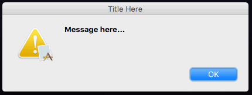

### Question Boxes
---
* `.yesNoBox(title, message, parent=None)`  
    Shows a question, with Yes/No buttons. Returns True/False.  
    If this dialog is being launched from a [subWindow](/pythonWidgetGrouping/#sub-window) set `parent` to be the name of the subWindow.  
    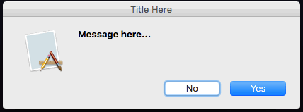

* `.questionBox(title, message, parent=None)`  
    Shows a question, with Yes/No buttons. Returns True/False.  
    If this dialog is being launched from a [subWindow](/pythonWidgetGrouping/#sub-window) set `parent` to be the name of the subWindow.  
    

* `.okBox(title, message, parent=None)`  
    Shows a question, with OK/Cancel buttons. Returns True/False.  
    If this dialog is being launched from a [subWindow](/pythonWidgetGrouping/#sub-window) set `parent` to be the name of the subWindow.  
    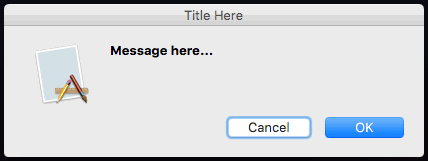

* `.retryBox(title, message, parent=None)`  
    Shows a question, with Cancel/Retry buttons. Returns True/False.  
    If this dialog is being launched from a [subWindow](/pythonWidgetGrouping/#sub-window) set `parent` to be the name of the subWindow.  
    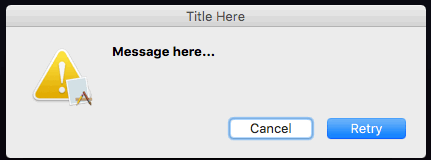

* `.stringBox(title, message, parent=None)`  
    Shows a question requesting a text response. Returns a String, or None if Cancel pressed.  
    If this dialog is being launched from a [subWindow](/pythonWidgetGrouping/#sub-window) set `parent` to be the name of the subWindow.  
    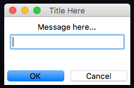

* `.integerBox(title, message, parent=None)`  
    Shows a question requesting an integer response. Returns an integer, or None if Cancel pressed.  
    If this dialog is being launched from a [subWindow](/pythonWidgetGrouping/#sub-window) set `parent` to be the name of the subWindow.  
    

* `.floatBox(title, message, parent=None)`  
    Shows a question requesting a float response. Returns a float, or None if Cancel pressed.  
    If this dialog is being launched from a [subWindow](/pythonWidgetGrouping/#sub-window) set `parent` to be the name of the subWindow.  
    

### appJar Question Boxes
---

* `.textBox(title, message, parent=None)`  
    Shows a question requesting a text response. Returns a String, or None if Cancel pressed.  
    If this dialog is being launched from a [subWindow](/pythonWidgetGrouping/#sub-window) set `parent` to be the name of the subWindow.  
    

* `.numberBox(title, message, parent=None)`  
    Shows a question requesting a numeric response. Returns a number, or None if Cancel pressed.  
    If this dialog is being launched from a [subWindow](/pythonWidgetGrouping/#sub-window) set `parent` to be the name of the subWindow.  
    

### File Boxes
---
* `.openBox(title=None, dirName=None, fileTypes=None, asFile=False, parent=None)`  
    Shows an open file dialog.  
    If this dialog is being launched from a [subWindow](/pythonWidgetGrouping/#sub-window) set `parent` to be the name of the subWindow.  

    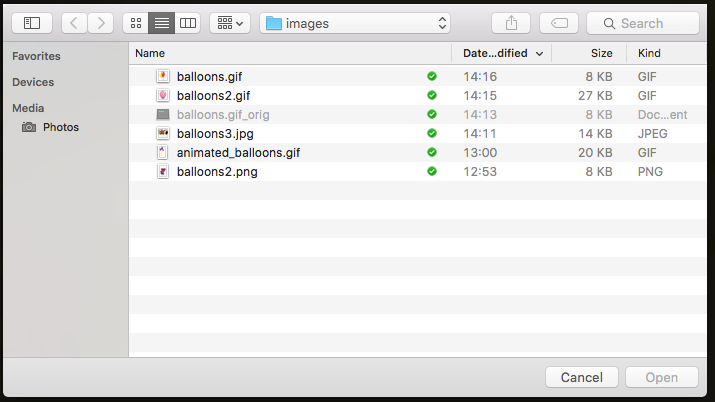  
      
    Various parameters can be provided (although they don't work on all platforms):  

    * ```title``` this will set a title for the dialog  
    * `dirName` this will set a starting directory, defaults to the current working directory  
    * `fileTypes=[('images', '*.png'), ('images', '*.jpg')]`  
    This will set the allowed file extensions, it should be a list of tuples. They will be grouped by the name.  
    * `asFile` this will determine whether a path or actual Python file object is returned, defaults to filename   

<br>

* `.saveBox(title=None, fileName=none, dirName=None, fileExt=".txt", fileTypes=None, asFile=None, parent=None)`  
    Shows a save file dialog.  
    If this dialog is being launched from a [subWindow](/pythonWidgetGrouping/#sub-window) set `parent` to be the name of the subWindow.  

    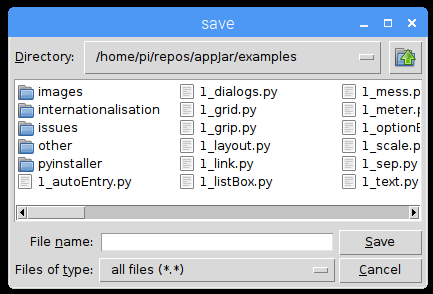  

    Various parameters can be provided (although they don't work on all platforms):  

    * ```title``` this will set a title for the dialog  
    * `fileName` this will set a starting file name to save as  
    * `dirName` this will set a starting directory, defaults to the current working directory  
    `fileExt` this will set a file extension to start with  
    * `fileTypes=[('images', '*.png'), ('images', '*.jpg')]`  
    This will set the allowed file extensions, it should be a list of tuples. They will be grouped by the name.  
    * `asFile` this will determine whether a path or actual Python file object is returned, defaults to filename   

<br>

* `.directoryBox(title=None, dirName=None, parent=None)`
    Shows a choose directory dialog.  
    If this dialog is being launched from a [subWindow](/pythonWidgetGrouping/#sub-window) set `parent` to be the name of the subWindow.  

    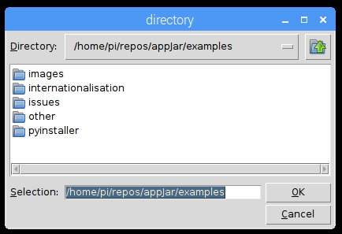  

    * ```title``` this will set a title for the dialog  
    * `dirName` this will set a starting directory, defaults to the current working directory  

### Other Boxes
---
* `.colourBox(colour="#FF0000", parent=None)`
    Shows a dialog for choosing colours.  
    If this dialog is being launched from a [subWindow](/pythonWidgetGrouping/#sub-window) set `parent` to be the name of the subWindow.  

    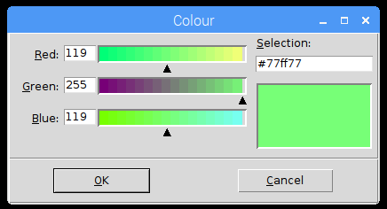  

    Can be passed a colour to start with, defaults to red.  
