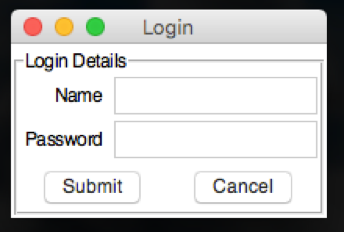
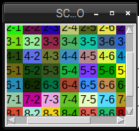
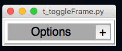
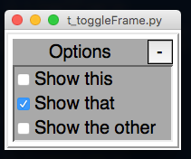
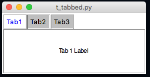
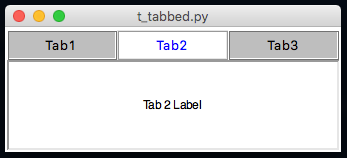
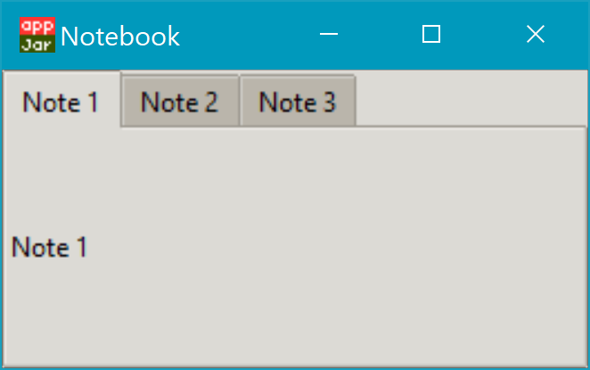
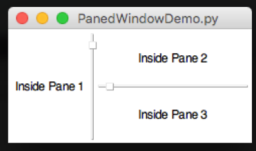
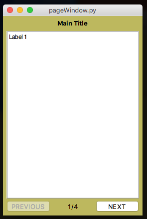

# Grouping Widgets  
----
The standard way of using *appJar*, is simply to place all widgets into a single window.  
Everything is grouped into that single window, and any changes affect everything in that window.  

It's sometimes desirable to group widgets together within a window.  
Or to have multiple *pages* of widgets.  
A number of options are provided to make this easier.  

### Format  
All of these methods work in the same way.  
You call the `start` function when you want to start a container, then the `stop` function when you're done.  
When you call `start` you can pass in positional arguments like any other widget (row, column, rowspan, colspan).  
Any [GUI Options](pythonGuiOptions) you set, within the container, will only affect that container.  

#### Reopening Containers  
If you want to dynamically add widgets to a container, once the gui has been started, you can open a specific container, perform the desired actions, then stop it again.
```python
def addRows(btn):
    count = app.getEntry("numRows")
    app.openTab("tabbedPane", "Details Tab") # open the required tab
    for rowLoop in range(count):
        # add a new label, with a unique ID
        # make sure to put it in the right place
        app.addLabel("dyn"+str(rowLoop), "Dynamic Label", rowLoop+5)
    app.stopTab()
```

### Frame
A way of grouping together widgets.  
Position the *Frame* within the grid, then position widgets inside the *Frame*  


```python
from appJar import gui 

app=gui("FRAME DEMO", "250x150")
app.setBg("yellow")

app.startFrame("LEFT", row=0, column=0)
app.setBg("blue")
app.setSticky("NEW")
app.setStretch("COLUMN")

app.addLabel("LEFT LABEL", "Label on the left 1")
app.setLabelBg("LEFT LABEL", "red")
app.addLabel("LEFT LABEL2", "Label on the left 2")
app.setLabelBg("LEFT LABEL2", "orange")
app.addLabel("LEFT LABEL3", "Label on the left 3")
app.setLabelBg("LEFT LABEL3", "yellow")
app.stopFrame()

app.startFrame("RIGHT", row=0, column=1)
app.setBg("green")
app.setFg("white")
for x in range(5):
    app.addRadioButton("RADIO", "Choice " + str(x))
app.stopFrame()

app.go()

```
Or in v1.0:  

```python
from appJar import gui 

with gui("FRAME DEMO", "250x150", bg='yellow') as app:

    with app.frame("LEFT", row=0, column=0, bg='blue', sticky='NEW', stretch='COLUMN'):
        app.label("Label on the left 1", bg='red')
        app.label("Label on the left 2", bg='orange')
        app.label("Label on the left 3", bg='yellow')

    with app.frame("RIGHT", row=0, column=1, bg='green', fg='white'):
        for x in range(5):
            app.radio("RADIO", "Choice " + str(x))
```

#### Start/Stop Frames  
* `.startFrame(name)` & `.stopFrame()`  
    Used to start and stop a *Frame*.  

* `.openFrame(title)`  
    Used to reopen the named *Frame*.  

#### Juggling Frames  
* `.raiseFrame(name)`  
    Lifts the named frame to the top of the grid stack.  
    If two frames are placed in the same grid square, this is used to determine which is on top.  
    By default, the last frame added is on top.  

```python
from appJar import gui 

with gui() as app:
    with app.frame("ONE", 0,0):
        app.label("In frame one")
    with app.frame("TWO", 0,0):
        app.label("In frame two")

    app.buttons(["ONE", "TWO"], app.raiseFrame)
```

### Frame Stack
---

A way of having mutiple frames on top of each other, with all but one hidden.  
Each frame is created and added to the stack. Then they can be navigated through, using `first`, `next`, `prev` and `last`.  

```python
from appJar import gui

def press(btn):
    if btn == "FIRST": app.firstFrame("Pages")
    elif btn == "NEXT": app.nextFrame("Pages")
    elif btn == "PREV": app.prevFrame("Pages")
    elif btn == "LAST": app.lastFrame("Pages")

app=gui("FRAME STACK")

app.startFrameStack("Pages")

app.startFrame()
for i in range(5):
    app.addLabel("Text: " + str(i))
app.stopFrame()

app.startFrame()
for i in range(5):
    app.addEntry("e" + str(i))
app.stopFrame()

app.startFrame()
for i in range(5):
    app.addButton(str(i), None)
app.stopFrame()

app.stopFrameStack()

app.addButtons(["FIRST", "PREV", "NEXT", "LAST"], press)
app.go()
```
Or in v1.0:  

```python
from appJar import gui 

def press(btn):
    if btn == "FIRST": app.firstFrame("Pages")
    elif btn == "NEXT": app.nextFrame("Pages")
    elif btn == "PREV": app.prevFrame("Pages")
    elif btn == "LAST": app.lastFrame("Pages")

with gui("FRAME STACK") as app:
    with app.frameStack("Pages", start=0):
        with app.frame():
            for i in range(5):
                app.label("Text: " + str(i))
        with app.frame():
            for i in range(5):
                app.entry("e" + str(i))
        with app.frame():
            for i in range(5):
                app.button(str(i), None)

    app.buttons(["FIRST", "PREV", "NEXT", "LAST"], press)
```

#### Start/Stop Frame Stacks  
* `.startFrameStack(title, change=None, start=-1)` & `.stopFrameStack()`  
    Used to start & stop a *FrameStack*  
    Multiple *Frames* should be added to the *FrameStack* and can then be navigated through.  
    Set `start` to the frame you want initially displayed. Defaults to the last frame added.  
    Set `change` to a function to call when the *FrameStack* is changed.  

* `.openFrameStack(title)`  
    Used to reopen the named *FrameStack*, for later modification.  

* `.setFrameStackChangeFunction(title, function)`  
    Sets a function to call whenever the *FrameStack* is changed.  
    If this function returns `False`, then the frame won't change (if it returns nothing, then it will change).  
    Useful when used in conjunction with `.getPreviousFrame(title)` as checks can be run before allowing the user to progress.  

* `.setStartFrame(title, num)`  
    Sets the frame that will be displayed when the GUI starts.  

#### Navigating Frame Stacks  
* `.frameStackAtStart(title)` & `.frameStackAtEnd(title)`  
    Returns True/False if the FrameStack is showing the first/last Frame.  

* `.nextFrame(title, callFunction=True)`  
    Display the next frame in the stack.  

* `.prevFrame(title, callFunction=True)`  
    Display the previous frame in the stack.  

* `.firstFrame(title, callFunction=True)`  
    Display the first frame in the stack.  

* `.lastFrame(title, callFunction=True)`  
    Display the last frame in the stack.  

* `.selectFrame(title, num, callFunction=True)`  
    Display the frame ay the specified position in the stack (starting at 0).  

* `.getPreviousFrame(title)` & `.getCurrentFrame(title)`  
    Returns the frame number of the previously shown and currently show frame.  

* `.countFrames(title)`  
    Returns the number of frames in the stack.  

### Label Frame
---

A way of grouping widgets into a box, with a label at the top of the box.  
Position the *LabelFrame* within the grid, then position widgets inside the *LabelFrame*  

**NB.** *LabelFrames* have a different [stickiness](/pythonWidgetLayout/#widget-positioning) to the *appJar* GUI - they only stick widgets to the `w` (left) side.  
If you want your widgets to stretch across the *LabelFrame*, like the rest of *appJar*, you will need to call `app.setSticky("ew")` after starting the *LabelFrame*.  


```python
from appJar import gui

app=gui()

app.startLabelFrame("Login Details")
# these only affect the labelFrame
app.setSticky("ew")
app.setFont(20)

app.addLabel("l1", "Name", 0, 0)
app.addEntry("Name", 0, 1)
app.addLabel("l2", "Password", 1, 0)
app.addEntry("Password", 1, 1)
app.addButtons(["Submit", "Cancel"], None, 2, 0, 2)
app.stopLabelFrame()

app.go()
```

#### Start/Stop Label Frames  
* `.startLabelFrame(title, hideTitle=False, label=None)` & `.stopLabelFrame()`  
    Used to start and stop a *LabelFrame*  
    The specified title will be used as the label for the frame.  
    Set `label` if you want to show a different label for the frame.  
    Set `hideTitle` to be True or `label` to be an empty String if you don't want to show a title.  

* `.openLabelFrame(title)`  
    Used to reopen the named *LabelFrame*, for later modification.  

#### Set Label Frames  
* `.setLabelFrameTitle(title, newTitle)`  
    Used to change the label displayed in the *LabelFrame*.  

* `.setLabelFrameAnchor(title, position)`  
    Used to change the position of the label on the *LabelFrame*.  
    Use compass coordinates, eg. `"ne"` or `"sw"`.  

* `.setSticky(coords)`  
    By default, widgets in the frame will align on the left.  
    If you want to change this, specify a different `sticky` value.  
    For example, `.setSticky("ew")` will cause the widgets to stretch to fit the width, aligning in the centre.  

### Scroll Pane  
---
A scrollable pane, inside a frame, to contain widgets.  
Allows you to have more widgets than will fit on the screen, or have a smaller window than required.



```python
from appJar import gui 

app=gui("SCROLLABLE DEMO", "150x150")

app.startScrollPane("PANE")
for x in range(10):
    for y in range(10):
        name = str(x) + "-" + str(y)
        app.addLabel(name, name, row=x, column=y)
        app.setLabelBg(name, app.RANDOM_COLOUR())
app.stopScrollPane()

app.go()
```

#### Scrolling

The *ScrollPane* has been configured to allow scrolling through lots of different methods:  

* On Mac & Windows horizontal & vertical scroll events (generated by amouse/trackpad) will work as normal.  
* On Linux horizontal scroll events will work, &lt;SHIFT&gt; horizontal scroll events will scroll vertically.  
* The following key presses will also work:  
    * &lt;Up&gt; & &lt;Down&gt;: Move up or down the equivalent of a line  
    * &lt;Left&gt; & &lt;Right&gt;: Move left or right the equivalent of a line  
    * &lt;PageUp&gt; & &lt;PageDown&gt;: Move up or down the equivalent of a page  
    * &lt;Ctrl&gt;&lt;PageUp&gt; & &lt;Ctrl&gt;&lt;PageDown&gt;: Move left or right the equivalent of a page  
    * &lt;Ctrl&gt;&lt;Up&gt; & &lt;Ctrl&gt;&lt;Down&gt;: Move up or down the equivalent of a page  
    * &lt;Ctrl&gt;&lt;Left&gt; & &lt;Ctrl&gt;&lt;Right&gt;: Move left or right the equivalent of a page   
    * &lt;Home&gt; & &lt;End&gt;: Move to the top or bottom  
    * &lt;Ctrl&gt;&lt;Home&gt; & &lt;Ctrl&gt;&lt;End&gt;: Move to the far-left or the far-right  

#### Start/Stop Scroll Panes  

* `.startScrollPane(title)` & `.stopScrollPane()`  
    Used to start and stop the *ScrollPane*.  
    Pass a `disabled` parameter of **horizontal** or **vertical** to disable one of the scrollbars.  

* `.openScrollPane(title)`  
    Used to reopen the named *ScrollPane*, for later modification.  

### Toggle Frame
----
A collapsible container for a group of related widgets.  
By default, the contents of the frame are hidden.  
They can be revealed/hidden again by clicking an associated button.  


```python
from appJar import gui

app=gui()
app.setFont(20)

app.startToggleFrame("Options")
app.addCheckBox("Show this")
app.addCheckBox("Show that")
app.addCheckBox("Show the other")
app.setCheckBox("Show that")
app.stopToggleFrame()

app.go()
```
#### Start/Stop Toggle Frames  
* `.startToggleFrame(title)` & `.stopToggleFrame(title)`  
    Used to start and stop a *ToggleFrame*.  
    The `title` will be used as the title for the *ToggleFrame*.  

* `.openToggleFrame(title)`  
    Used to reopen the named *ToggleFrame*.  
#### Set Toggle Frames  
* `.setToggleFrameText(title, newText)`  
    Will update the text displayed in the *ToggleFrame*.  

* `.toggleToggleFrame(title)`  
    Will toggle the state of the specified *ToggleFrame*.  

* `.disableToggleFrame(title, disabled=True)`  
    Will disable the specified *ToggleFrame*.  
    If `disabled` is set to False, the *ToggleFrame* will be re-enabled.  
#### Get Toggle Frames  
* `.getToggleFrameState(title)`  
    Will return True if the *ToggleFrame* is open, else will return False.  

### Tabbed Frame
---

A way to create a (basic) tabbed-style interface.  
Position the *TabbedFrame* within the grid, start a *Tab*, then position widgets inside the *Tab*  
  
```python
from appJar import gui

app=gui()

app.startTabbedFrame("TabbedFrame")
app.startTab("Tab1")
app.addLabel("l1", "Tab 1 Label")
app.stopTab()

app.startTab("Tab2")
app.addLabel("l2", "Tab 2 Label")
app.stopTab()

app.startTab("Tab3")
app.addLabel("l3", "Tab 3 Label")
app.stopTab()
app.stopTabbedFrame()

app.go()
```
#### Start/Stop Tabbed Frames
* `.startTabbedFrame(name)` & `.stopTabbedFrame()`  
    Used to start & stop a *TabbedFrame*, with the specified name.  

* `.startTab(name)` & `.stopTab()`  
    Used to start and stop each of the tabs in the *TabbedFrame*.  
    The title for the tab will be the specified *name*.  

* `.openTabbedFrame(title)` & `.openTab(frameTitle, tabTitle)`  
    Used to reopen the named *TabbedFrame* or named *Tab*.  

#### Set TabbedFrame

* `.setTabText(title, tab, newText=None)`  
    Change the text of the named tab in the specified *TabbedFrame*.  
    If no `newText` is provided, the tab will revert back to its original text.  

* `.setTabbedFrameTabExpand(title, expand=True)`  
    By default, the tabs take up the minimum amount of space necessary.  
    Set this to True, to have the tabs fill the entire row.  
  

* `.setTabbedFrameSelectedTab(title, tab)`  
    Select the specified tab in the TabbedFrame.  

* `.setTabbedFrameDisabledTab(title, tab, disabled=True)`  
    Disable the specified tab in the TabbedFrame.  
    Set disabled to False to re-enable it.  
    This will also change the displayed tab, if the displayed tab is being disabled.  

* `.setTabbedFrameDisableAllTabs(title, disabled=True)`  
    Will disable all tabs for the named TabFrame.  
    Or, enable them if disabled is set to False.  

#### Changing Colours  
TabbedFrames have a set of colours that can be changed:  

* `ActiveFg` - Sets the colour of the text in the active tab  
* `ActiveBg` - Sets the background colour of the active tab  
* `InactiveFg` - Sets the colour of the text in all inactive tabs  
* `InactiveBg` - Sets the background colour of all inactive tabs  
* `DisabledFg` - Sets the colour of the text in all disabled tabs  
* `DisabledBg` - Sets the background colour of all disabled tabs  
* `Bg` - Sets the background colour behind the widget - only visible at the end of the tabs  

These are all changed via the standard property changing functions, eg:  

* `.setTabbedFrameBg("t1", "red")`
* `.setTabbedFrameActiveBg("t1", "yellow")`

It is also possible to change the colour of individual panes.  
Call `.setBg("colour")` while adding widgets to the specific pane.  
Or `.setTabBg(title, tab, 'colour')` at other times.  

#### Get TabbedFrame
* `.getTabbedFrameSelectedTab(title)`  
    Gets the name of the currently selected tab, for the named TabFrame.  

### Notebook
---
**NB.** This will only work with [ttk](pythonTtk) enabled.  
**NB.** *Notes* have a different [stickiness](/pythonWidgetLayout/#widget-positioning) to the *appJar* GUI - they only stick widgets to the `w` (left) side.
If you want your widgets to stretch across the *Note*, like the rest of *appJar*, you will need to call `app.setSticky("ew")` after starting the *Note*.

Similar to the [*Tabbed Frame*](/pythonWidgetGrouping/#tabbed-frame), it is a way of placing widgets in different tabs or 'notes'.
Position the *Notebook* within the grid, start a *Note*, then position widgets inside the *Note*.



```python
from appJar import gui

app = gui("Notebook", useTtk=True)

app.setTtkTheme("clam")

app.startNotebook("Notebook")

app.startNote("Note 1")
app.addLabel("l1", "Note 1")
app.stopNote()

app.startNote("Note 2")
app.addLabel("l2", "Note 2")
app.stopNote()

app.startNote("Note 3")
app.addLabel("l3", "Note 3")
app.stopNote()

app.stopNotebook()

app.go()
```

#### Start/Stop Notebooks
* `.startNotebook(name)` & `.stopNotebook()`  
    Used to start & stop *Notebooks*, with the specified name.

* `.startNote(name)` & `.stopNote()`  
    Used to start & stop each of the notes in the *Notebook*.

#### Set Notebooks
* `.getNotebookWidget(name).select([index])`  
    Change the currently selected note, by putting the *Notebook's* name in `name` and putting the index of the note as an integer in `index`.  
    Eg. To change the selected note to Note 3, then the index would be 2 (as 0 is the first note).

#### Styles & Colours
* You will need to use a [ttk Style and Map](/pythonTtk/#styling-ttk-widgets) to change the colour of notebook widget or its tabs.

* To change the style for the Notebook widget, use `TNotebook`.

* To change the style for the Notebook Tabs, use `TNotebook.Tab`.


### Paned Frame
---
A way to present re-sizable panes, separated by drag-bars.  
Once the first pane is placed, all additional panes should be placed inside it.  
By default, panes will be placed side-by-side (horizontally).  
This can be changed by setting the pane to vertical, then they'll be placed underneath each other.  

#### Start/Stop Paned Frames  
* `.startPanedFrame(name)`, `.startPanedFrameVertical(name)` & `.stopPanedFrame()`  
    Used to start & stop *PanedFrames*, with the specified name.  
    By default, any panes added to this pane will be added side-by-side (horizontally).  
    Starting a vertical pane will cause additional panes to be stacked on top of each other.  

* `.openPanedFrame(title)`  
    Used to reopen the named *PanedFrame*.  

#### Horizontal Pane Layout  
  

* Start an initial pane  
* Start all additional panes inside the initial pane  

```python
from appJar import gui
app = gui()

# start initial pane
app.startPanedFrame("p1")
app.addLabel("l1", "Inside Pane 1")

# start additional panes inside initial pane
app.startPanedFrame("p2")
app.addLabel("l2", "Inside Pane 2")
app.stopPanedFrame()

app.startPanedFrame("p3")
app.addLabel("l3", "Inside Pane 3")
app.stopPanedFrame()

# stop initial pane
app.stopPanedFrame()

app.go()
```

#### Vertical Pane Layout  
  

* Start an initial, vertical pane  
* Start all additional panes inside the initial pane  

```python
from appJar import gui
app = gui()

# start initial, vertical pane
app.startPanedFrameVertical("p1")
app.addLabel("l1", "Inside Pane 1")

# start additional panes inside initial pane
app.startPanedFrame("p2")
app.addLabel("l2", "Inside Pane 2")
app.stopPanedFrame()

app.startPanedFrame("p3")
app.addLabel("l3", "Inside Pane 3")
app.stopPanedFrame()

# stop initial pane
app.stopPanedFrame()

app.go()
```

#### E-Pane Layout  
  

* Start an initial pane  
* Start a second, vertical pane inside the initial pane  
* Start all additional panes inside the second pane  

```python
from appJar import gui
app = gui()

# start initial pane
app.startPanedFrame("p1")
app.addLabel("l1", "Inside Pane 1")

# start second, vertical pane inside initial pane
app.startPanedFrameVertical("p2")
app.addLabel("l2", "Inside Pane 2")

# start additional panes inside second pane
app.startPanedFrame("p3")
app.addLabel("l3", "Inside Pane 3")
app.stopPanedFrame()

# stop second & initial panes
app.stopPanedFrame()
app.stopPanedFrame()

app.go()
```

#### T-Pane Layout  
  

* Start an initial, vertical pane  
* Start a second pane, inside the initial pane  
* Start additional panes inside the second pane  

```python
from appJar import gui
app = gui()

# start intial, vertical pane
app.startPanedFrameVertical("p1")
app.addLabel("l1", "Inside Pane 1")

# start second pane
app.startPanedFrame("p2")
app.addLabel("l2", "Inside Pane 2")

# start additional panes inside second pane 
app.startPanedFrame("p3")
app.addLabel("l3", "Inside Pane 3")
app.stopPanedFrame()

# stop second & initial panes
app.stopPanedFrame()
app.stopPanedFrame()

app.go()
```

### Paged Window
---
A container that mimics a classic phone based interface.  
It provides **PREVIOUS**/**NEXT** buttons to navigate through a series of pages.  
It has an optional widget title, and shows the current page, in a page counter.  
Keyboard bindings are provided to navigate with arrow key presses. CTRL-arrow will navigate to the beginning/end.  
Events can be bound to page changes, the page can be changed via a function call, and the current page number can be queried.  

```python
from appJar import gui

app=gui()

app.setBg("DarkKhaki")
app.setSize(280,400)

app.startPagedWindow("Main Title")
app.startPage()
app.addLabel("l13", "Label 1")
app.stopPage()

app.startPage()
app.addLabel("l21", "Label 2")
app.stopPage()

app.startPage()
app.addLabel("l3", "Label 3")
app.stopPage()

app.startPage()
app.addLabel("l4", "Label 4")
app.stopPage()
app.stopPagedWindow()

app.go()
```
#### Start/Stop Paged Windows
* `.startPagedWindow(title)` & `.stopPagedWindow()`  
    Used to start and stop a *PagedWindow*.  
    The `title` will be used in the title section of the widget.  

* `.startPage()` & `.stopPage()`  
    Used to start and stop each new page.  
    Navigation, page count, etc are all dealt with automatically.  

* `.openPagedWindow(title)` & `.openPage(windowTitle, pageNumber)`   
    Used to reopen the named *PagedWindow* or *Page*.  
    **NB.** `pageNumber` must be an integer, starting at 1 for the first page.  

#### Set Paged Windows
* `.setPagedWindowTitle(title, title)` & `.setPagedWindowButtons(title, [buttons])`  
    Used to change the text in the title and buttons.  
    When changing the buttons, two values must be passed in: previous/next.  

* `.setPagedWindowButtonsTop(title, top=True)`  
    Used to position the navigation buttons.  By default, they are at the bottom.  
    Call this function to move them to the top.  

* `.setPagedWindowPage(title, pageNum)`  
    Used to display the selected page.  

* `.setPagedWindowFunction(title, function)`  
    Declare a function to call, each time the page is changed.  

* `.showPagedWindowPageNumber(title, show=True)` & `.showPagedWindowTitle(title, show=True)`  
    Use these to declare if you want the page title, page numbers to be shown.  
#### Get Paged Windows
* `.getPagedWindowPageNumber(title)`  
    Used to get the page number currently being shown.  

### Sub Window
---

A way to add additional windows, which can be hidden and shown.  


This has been moved to its own page: [Multiple Windows](/pythonSubWindows).  
