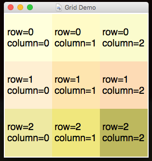
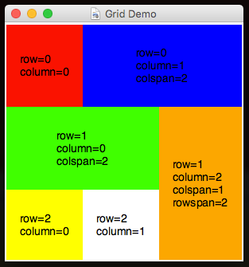
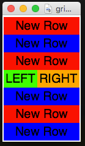
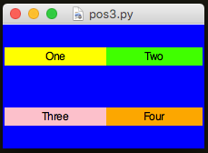
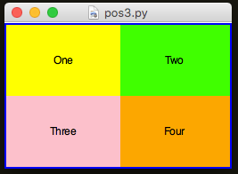
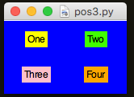
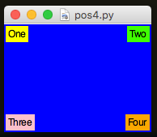
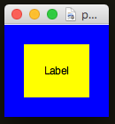
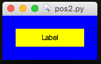

#Arranging Widgets
---

You can make your GUIs as simple or as complicated as you want...  

###Sequential Layout
---
By default, each time you add a widget to a GUI, it is simply added on a new row:  


```python
from appJar import gui  

def changeLabel(btn):  
    app.setLabel("l2", app.getEntry("text"))  

app = gui()  
app.addLabel("l1", "Simple Demo")
app.addEntry("text")
app.addButton("OK", changeLabel)
app.addEmptyLabel("l2")
app.go()
```

---
<div style='text-align: center;'>
*Advertisement&nbsp;<sup><a href="/advertising">why?</a></sup>*
<script async src="//pagead2.googlesyndication.com/pagead/js/adsbygoogle.js"></script>
<ins class="adsbygoogle"
    style="display:block"
    data-ad-format="fluid"
    data-ad-layout-key="-gw-13-4l+6+pt"
    data-ad-client="ca-pub-6185596049817878"
    data-ad-slot="5627392164"></ins>
<script>(adsbygoogle = window.adsbygoogle || []).push({});</script>
</div>
---

###Grid Layout
---

If, however, you want a bit more control, then you can treat your GUI like a **GRID**.  
Think of it just like a spreadsheet, and position your widgets in whichever cell you want.  

Each time you add a widget, simply specify the row and column it should appear in (always in that order):  


```python
from appJar import gui

app=gui("Grid Demo", "300x300")
app.setSticky("news")
app.setExpand("both")
app.setFont(20)

app.addLabel("l1", "row=0\ncolumn=0", 0, 0)
app.addLabel("l2", "row=0\ncolumn=1", 0, 1)
app.addLabel("l3", "row=0\ncolumn=2", 0, 2)
app.addLabel("l4", "row=1\ncolumn=0", 1, 0)
app.addLabel("l5", "row=1\ncolumn=1", 1, 1)
app.addLabel("l6", "row=1\ncolumn=2", 1, 2)
app.addLabel("l7", "row=2\ncolumn=0", 2, 0)
app.addLabel("l8", "row=2\ncolumn=1", 2, 1)
app.addLabel("l9", "row=2\ncolumn=2", 2, 2)

app.setLabelBg("l1", "LightYellow")
app.setLabelBg("l2", "LemonChiffon")
app.setLabelBg("l3", "LightGoldenRodYellow")
app.setLabelBg("l4", "PapayaWhip")
app.setLabelBg("l5", "Moccasin")
app.setLabelBg("l6", "PeachPuff")
app.setLabelBg("l7", "PaleGoldenRod")
app.setLabelBg("l8", "Khaki")
app.setLabelBg("l9", "DarkKhaki")

app.go()
```

If you're still not satisfied, you can configure widgets to span across multiple columns or rows.  
Simply provide a third & fourth parameter to specify how many rows and columns to span:  



```python
from appJar import gui

app=gui("Grid Demo", "300x300")
app.setSticky("news")
app.setExpand("both")
app.setFont(14)

app.addLabel("l1", "row=0\ncolumn=0")
app.addLabel("l2", "row=0\ncolumn=1\ncolspan=2", 0, 1, 2)
app.addLabel("l4", "row=1\ncolumn=0\ncolspan=2", 1, 0, 2)
app.addLabel("l6", "row=1\ncolumn=2\ncolspan=1\nrowspan=2", 1, 2, 1, 2)
app.addLabel("l7", "row=2\ncolumn=0", 2)
app.addLabel("l8", "row=2\ncolumn=1", 2, 1)

app.setLabelBg("l1", "red")
app.setLabelBg("l2", "blue")
app.setLabelBg("l4", "green")
app.setLabelBg("l6", "orange")
app.setLabelBg("l7", "yellow")

app.go()
```

Note, the parameters are read from left to right, so:  

* If you're specifying a column, you must first specify a row  
* If you're specifying a row-span, you must first specify both the row & column  
* And, if you're specifying a column-span, you must first specify a row, column & column-span  

###Layout Tricks  
---
There are a few tricks you can employ, to make life a bit easier...

####Named Arguments  
It can be annoying having to specify all of the positional parameters each time, so why not take advantage of Python's support for *Named Arguments*. These allow you to set specific parameters, using their name.  
For example: `app.addLabel("l1", "text here", colspan=2)`, will set the `colspan` parameter, without having to set the preceding ones.   

####Row Helpers

appJar tracks the next available row.:

* `.getRow()` or `.gr()`  
    Returns the next free row.  
    Useful if you're mainly adding things sequentially, but want to modify one line out of sequence.  



```python
from appJar import gui

colours=["red","blue"]

app=gui()

for loop in range(3):
    app.addLabel(loop, "New Row", colspan=2)
    app.setLabelBg(loop, colours[loop%2])

row = app.getRow() # get current row

app.addLabel("a", "LEFT", row, 0) 
app.addLabel("b", "RIGHT", row, 1) 

app.setLabelBg("a", "green")
app.setLabelBg("b", "orange")

for loop in range(3, 6):
    app.addLabel(loop, "New Row", colspan=2)
    app.setLabelBg(loop, colours[loop%2])

app.go()
```

Instead of calling `.getRow()`, you can specify the string "previous" or "p" to use the the previous row:  

```python
from appJar import gui 
with gui("LABS", "400x400", sticky="news") as app:
    app.label("0-0", bg="red")
    app.label("0-1", bg="orange", row="previous", column=1)
    app.label("0-2", bg="yellow", row="previous", column=2)
    app.label("1-0", bg="green")
    app.label("1-1-2", bg="blue", row="previous", column=1, colspan=2)
```

---
<div style='text-align: center;'>
*Advertisement&nbsp;<sup><a href="/advertising">why?</a></sup>*
<script async src="//pagead2.googlesyndication.com/pagead/js/adsbygoogle.js"></script>
<ins class="adsbygoogle"
    style="display:block"
    data-ad-format="fluid"
    data-ad-layout-key="-gw-13-4l+6+pt"
    data-ad-client="ca-pub-6185596049817878"
    data-ad-slot="5627392164"></ins>
<script>(adsbygoogle = window.adsbygoogle || []).push({});</script>
</div>
---

## Widget Positioning
---

Once you've laid out your widgets, the next most important thing is how they line up in their rows and columns.  

**NB.** These only take affect from the point they are added, so include them before adding the widgets.  

There are two things you can configure:    

* How columns and rows stretch to fill the GUI - **stretchiness**  
* How widgets stretch to fill their cells - **stickiness**  

Note, you can also change these settings for [individual widgets](pythonWidgetOptions/#advanced-looks)

####Set Stretch & Sticky

* `.setStretch(sides)`  
    This tells rows & columns how to stretch when the GUI is resized.  
    It allows them to adjust to fill the available space:
    * `none` - don't stretch  
    * `row` - only rows should stretch down  
    * `column` - only columns should stretch across  
    * `both` - stretch rows & columns  
* `.setSticky(sides)`  
    This determines which sides of the grid-cell the widget will stick to.  
    It should be a string, made up of any combination of `n`, `e`, `s` or `w`  
    By default, most widgets use `"ew"`

### Columns & Rows Stretchiness

By default, the columns stretch (equally) to fill the width of the GUI, but rows don't - they take up the minimum space required.    

  

It's possible to tell the rows to stretch too:

  
```python
app.setStretch("both")
``` 

But, as you can see - this doesn't make much difference...

###Widget Stickiness

Even if the cells in the columns & rows are stretching, the widgets inside them might not.  

Widgets have a **stickiness** which tells them which sides of their cells to stick to.  

Again, widgets are configured to stick to the left & right, but not the top & bottom.  

To change this, you need to set a new stickiness:  

  
```python
app.setStretch("both")
app.setSticky("nesw")
```

If you remove all stickiness, you end up with this:

  
```python
app.setStretch("both")
app.setSticky("")
```  

It's even possible to give each widget its own *stickiness*:  
  
```python
from appJar import gui

app=gui()

app.setBg("blue")
app.setStretch("both")

app.setSticky("nw")
app.addLabel("l1", "One", 0, 0)
app.setLabelBg("l1", "yellow")

app.setSticky("ne")
app.addLabel("l2", "Two", 0, 1)
app.setLabelBg("l2", "green")

app.setSticky("sw")
app.addLabel("l3", "Three", 1, 0)
app.setLabelBg("l3", "pink")

app.setSticky("se")
app.addLabel("l4", "Four", 1, 1)
app.setLabelBg("l4", "Orange")

app.go()
```  

##Widget Padding
It's possible to configure how much empty space is around a widget.  
This is known as padding. You can put padding both inside and outside a widget...  


```python
app.setPadding([20,20]) # 20 pixels padding outside the widget [X, Y]
app.setInPadding([20,20]) # 20 pixels padding inside the widget [X, Y]
```
####Set Padding & InPadding  
* `.setPadding([x,y])`
    This sets the X & Y padding outside a widget.  
* `.setInPadding([x,y])`
    This sets the X & Y padding inside a widget.  


```python
app.setPadding([20,20]) # padding outside the widget
app.setInPadding([40,20]) # padding inside the widget
```
