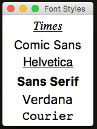

#Changing Widgets  
----
There are a lot of things that can be changed in a widget.  
There is a pattern to how this works, you simply specify the widget type and the parameter, eg:

* `.setLabelBg(name, value)`
* `.setButtonFg(name, value)`
* `.setListBoxState(name, value)`

This should work for most widgets & containers.  
Some widgets have different types, eg. TextArea & ScrolledTextArea, all types can be configured with the main widget name.  

###Basic  Looks
----
The following options are available for all widgets:

* `.set XXX Fg(name, value)`  
    Sets the foreground colour (usually the text) of the named widget.

* `.set XXX Bg(name, value)`  
    Sets the background colour of the named widget.

* `.set XXX DisabledFg(name, value)`  
    Sets the disabled foreground colour (usually the text) of the named widget.

* `.set XXX DisabledBg(name, value)`  
    Sets the disabled background colour of the named widget.

* `.set XXX ActiveFg(name, value)`  
    Sets the active foreground colour (usually the text) of the named widget.

* `.set XXX ActiveBg(name, value)`  
    Sets the active background colour of the named widget.

* `.set XXX Width(name, value)`  
    Sets the width of the named widget.

* `.set XXX Height(name, value)`  
    Set the height of the named widget.

* `.set XXX Relief(name, value)`  
    Sets the border of the named widget. One of: `"sunken"`, `"raised"`, `"groove"`, `"ridge"`, `"flat"`  

* `.set XXX State(name, value)`  
    Sets the state of the named widget. One of: `"normal"`, `"active"`, `"disabled"`  

It's possible to change [global GUI settings](/pythonGuiOptions/#gui-design), such as the background and font.  
If you need to modify individual settings of a widget, you can access it directly, and use the traditional tKinter methods.  

To change the font for a specific widget, try the following:  

```python
app.addLabel("l1", "Times")
app.addLabel("l2", "Comic Sans")
app.addLabel("l3", "Helvetica")
app.addLabel("l4", "Sans Serif")
app.addLabel("l5", "Verdana")
app.addLabel("l6", "Courier")

app.getLabelWidget("l1").config(font="Times 20 italic underline")
app.getLabelWidget("l2").config(font=("Comic Sans", "20", "normal"))
app.getLabelWidget("l3").config(font="Helvetica 20 underline")
app.getLabelWidget("l4").config(font=("Sans Serif", "20", "bold"))
app.getLabelWidget("l5").config(font="Verdana 20 overstrike")
app.getLabelWidget("l6").config(font="Courier 20")
```

---
<div style='text-align: center;'>
*Advertisement&nbsp;<sup><a href="/advertising">why?</a></sup>*
<script async src="//pagead2.googlesyndication.com/pagead/js/adsbygoogle.js"></script>
<ins class="adsbygoogle"
    style="display:block"
    data-ad-format="fluid"
    data-ad-layout-key="-gw-13-4l+6+pt"
    data-ad-client="ca-pub-6185596049817878"
    data-ad-slot="5627392164"></ins>
<script>(adsbygoogle = window.adsbygoogle || []).push({});</script>
</div>
----

###Advanced Looks  
---

The following are supported by most widgets:

* `.set XXX Align(name, value)`  
    Specifies how to align text within the widget: `"left"`, `"right"`, `"center"`  
    Calls `justify` on the Entry widget, and anchor on all others (converting left/right into e/w)  .  

* `.set XXX Anchor(name, value)`  
    Sets where the text is positioned within the widget. One of: `"center"`, `"n"`, `"s"`, `"e"`, `"w"`, `"ne"`, `"nw"`, `"se"`, `"sw"`  

* `.set XXX Sticky(name, value)`  
    Specifies which side of the cell to stick the widget to, as the GUI expands: `"left"`, `"right"`, `"both"`

* `.set XXX Padding(name, [x, y])`  
    Set external padding of the named widget.  

* `.set XXX InPadding(name, [x, y])`  
    Set internal padding of the named widget.  

###Fancy Options  
---
* `.set XXX Tooltip(name, value)`  
    Sets a tooltip for the named widget, with the specified value.  
    The specified value will be displayed in a small pop-up, when the mouse is left over the widget.  
    If called a second time, it will update the text of the tooltip.  
    See [Tooltips](/pythonDialogs/#tooltips) for more info.  

* `.enable XXX Tooltip(name)` & `.disable XXX Tooltip(name)`  
    These will enable or disable the named tooltip. When disabled, it will not show-up.  

* `.set XXX Cursor(name, value)`  
    Sets the cursor shown, when the mouse goes over this widget.  
    There are lots of cursors available, for different platforms, see [here](http://infohost.nmt.edu/tcc/help/pubs/tkinter/web/cursors.html)

* `.set XXX RightClickMenu(name, menu)`  
    Links the right-click menu to the specified widget.  
    Make sure you have created a right-click menu first, `.createRightClickMenu(menu)` and added some menu-items to it.  
    See [Menubars](/pythonBars/#menubar) for more info.  

* `.set XXX Focus(name)`  
    Gives focus to the specified widget. This is the widget where the user will be able to start typing.

---
<div style='text-align: center;'>
*Advertisement&nbsp;<sup><a href="/advertising">why?</a></sup>*
<script async src="//pagead2.googlesyndication.com/pagead/js/adsbygoogle.js"></script>
<ins class="adsbygoogle"
    style="display:block"
    data-ad-format="fluid"
    data-ad-layout-key="-gw-13-4l+6+pt"
    data-ad-client="ca-pub-6185596049817878"
    data-ad-slot="5627392164"></ins>
<script>(adsbygoogle = window.adsbygoogle || []).push({});</script>
</div>
----

###Widget Manipulation
---

The following allow widgets to be manipulated on screen:

* `.disable XXX (name)`  
    Disable the widget - stops the user from interacting with it, but keeps it visible.

* `.enable XXX (name)`  
    Enable a disabled widget.

* `.hide XXX (name)`  
    Temporarily hides the widget from view.

* `.show XXX (name)`  
    Show the widget, if it was already hidden.

* `.remove XXX (name)`  
    Permanently remove the widget (deletes it).

* `.removeAllWidgets()`  
    Permanently remove all widgets.

###Grouped Options
----
The following are convenience functions, for modifying a group of widgets:  

* `.set XXX Widths(names, val)` & `.set XXX Heights(names, val)`  
    Sets the widths/heights of the specified widgets.

* `.setAll XXX Widths(val)` & `.setAll XXX Heights(val)`  
    Sets the widths/heights of all widgets of the specified type.

###tkinter Options
----
It's also possible to request a widget, and modify it directly:  

* `.get XXX Widget(name, value=None)`  
    This will get the named widget of the specified type.  
    Any standard tkinter options can then be changed.  
    If it's a RadioButton, you also need to specify a `value` - the text displayed in the widget.  
