#Widgets
----
In a GUI, the fillings are known as **widgets**.  
There are lots of different widgets to choose from, each suited to a specific task.  

Nearly every widget needs a **TITLE**.  
This is a unique name for the widget, so that later you can get information from that widget, or change it.  

Nearly all widgets in appJar provide the same three functions:

* (Always) - **ADD** a widget (with a unique title) - this creates the widget
* (Often) - **GET** the widget (using its unique title) - this gets the contents of the widget (usually done in a function)
* (Sometimes) - **SET** the widget (using its unique title) - this changes what's in the widget

On top of these, there is a common set of functions for [changing widgets](pythonWidgetOptions.md).  
As well as some specialist functions, unique to each widget (see below).  

##Label
---
*Labels* are used for displaying text in the GUI.  

* They are great for titles, at the top of the GUI, usually spanning multiple columns.  
* They are really useful before *Entries* and *Drop-downs* to explain their purpose.  
* And, they're very helpful at the bottom of the GUI, to show the results of an action.  
  
```python
from appJar import gui

app = gui()

app.addLabel("l1", "Label 1")
app.addLabel("l2", "Label 2")
app.addLabel("l3", "Label 3")
app.addLabel("l4", "Label 4")
# common set functions
app.setLabelBg("l1", "red")
app.setLabelBg("l2", "yellow")
app.setLabelBg("l3", "purple")
app.setLabelBg("l4", "orange")

app.go()
```

####Add Labels
* `.addLabel(title, text=None)`  
    This will create a label widget to display text in the GUI.  
    The `title` is used to uniquely identify the label, in case you want to change it later, and the `text` is what gets displayed.  
    If `text` is set to None, or no `text` is provided, the `title` will be displayed in the label.  

* `.addEmptyLabel(title)`  
    Does the same as add a *label*, except there's no parameter to set any text.

* `.addSelectableLabel(title, text=None)`  
    This adds a label whose text can be selected with the mouse.  
    This is really just a *read-only* Entry, disguised to look like a label.  
    But it seems to do the trick...  

* `.addFlashLabel(title, text=None)`  
    This adds a flashing *label*, that will alternate between the foreground and background colours.

  
```python
from appJar import gui

app = gui()

app.addFlashLabel("f1", "This is flashing")
app.addLabel("f2", "This is not flashing")
app.addFlashLabel("f3", "This is also flashing")

app.go()
```

####Set Labels
* `.setLabel(title, text)`  
    Change the contents of the *label*.

* `.clearLabel(title)`  
    Clear the contents of the *label*.

####Get Labels
* `.getLabel(title)`  
    Get the contents of the *label*.

##Auto-Labelled Widgets
___

It's possible to automatically include a *label* alongside a lot of the  widgets.  
Both the label and widget will be placed in the same grid space.  
Simply add the word `Label` to the command when adding the widget:  

* `.addLabelEntry(title)`
* `.addLabelNumericEntry(title)`
* `.addLabelSecretEntry(title)`
* `.addLabelAutoEntry(title, words)`
* `.addLabelScale(title)`
* `.addLabelOptionBox(title, values)`
* `.addLabelTickOptionBox(title, values)`
* `.addLabelSpinBox(title, values)`
* `.addLabelSpinBoxRange(title, from, to)`  

See the relevant section for a description of what the widget does.

##Entry
____
Entries are used to capture input from the user. They take a single parameter - a title.

There are five special-case Entries:

* NumericEntry - this only allows numbers to be typed in - always returns a float (None if empty).
* SecretEntry - this will show stars, instead of the letters typed - useful for capturing passwords.
* AutoEntry - this takes a list of words to provide auto-completion.  
* ValidationEntry - can be set to valid/invalid/waiting - will colour the border green/red/black and show a ✔/✖/★  
* FileEntry/DirectoryEntry - provides a button to select a file/directory and auto-populates the Entry  

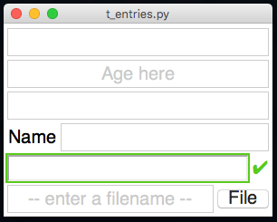

```python
from appJar import gui

app=gui()

app.addEntry("e1")
app.addEntry("e2")
app.addEntry("e3")
app.addLabelEntry("Name")
app.addValidationEntry("v1")
app.addFileEntry("f1")

app.setEntryDefault("e2", "Age here")
app.setEntryValid("v1")

app.go()
```

####Add Entries

* `.addEntry(title)`
* `.addNumericEntry(title)`
* `.addSecretEntry(title)`
* `.addAutoEntry(title, words)`  
* `.addValidationEntry(title)`  
* `.addFileEntry(title)`  
* `.addDirectoryEntry(title)`  

    Each of these will add the specified type of Entry, using the title provided.

#### Set Entries
* `.setEntry(title, text, callFunction=True)`  
    This sets the contents of the specified Entry.  
    Set ```callFunction``` to be False, if you don't want to call any associated functions.  

* `.setEntryDefault(title, text)`  
    This sets a default value to display in an Entry.  
    Once the user starts typing, it will disappear.  
    The text is centered, shown in a light gray font, and will not be returned by `.getEntry(title)`  

* `.setEntryUpperCase(title)` & `.setEntryLowerCase(title)`   
    This will force all text typed into the Entry to be uppercase/lowercase.  

* `.setEntryMaxLength(title, maxLength)`  
    This will set a maximum length for the specified Entry.  
    Any additional characters typed will be discarded.  

* `.setEntryValid(title)` & `.setEntryInvalid(title)` & `.setEntryWaitingValidation(title)`  
    These will set the relevant status of a validation Entry.  
    (Have a look [here](/specialCharacters) for help displaying special characters)  
    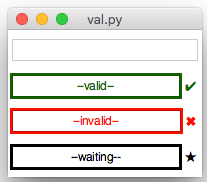

* `.setValidationEntry(title, state="valid")`  
    Same as above, set flag to one of `valid`, `invalid` or `wait`.  

* `.setAutoEntryNumRows(title, rows)`  
    This will set the number of rows to display in an AutoEntry.  
    NB. this is limited to the depth of the GUI - if there is no space, then no rows will be displayed. 
    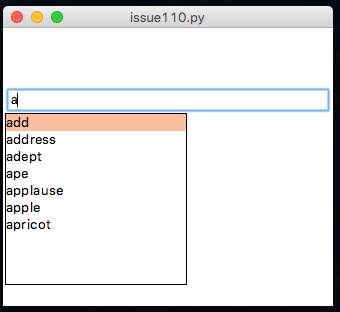  

* `.appendAutoEntry(title, value)`  
    This will add the value/list of values to the specified AutoEntry.  

* `.removeAutoEntry(title, value)`  
    This will remove the value from the specified AutoEntry.  

* `.changeAutoEntry(title, value)`  
    This will replace all items in the specified AutoEntry with a new list of values.  

* `.clearEntry(title, callFunction=True)`  
    This will clear the contents of the specified Entry.
    Set ```callFunction``` to be False, if you don't want to call any associated functions.  

* `.clearAllEntries(callFunction=False)`  
    This will clear all Entries in the GUI.  
    Set ```callFunction``` to be True, if you want to call any associated functions.  

* `.setFocus(title)`  
    This will put the cursor in the specified Entry, so that the user can start typing without needing to click.

#### Get Entries
* `.getEntry(title)`  
    This will return the contents of the specified Entry.  
    NB. *numericEntries* always return a float.  

* `.getAllEntries()`  
    This will return the contents of all Entries in the app, as a dictionary.  
    NB. *numericEntries* always return a float.  

---
<div style='text-align: center;'>
*Advertisement&nbsp;<sup><a href="/advertising">why?</a></sup>*
<script async src="//pagead2.googlesyndication.com/pagead/js/adsbygoogle.js"></script>
<ins class="adsbygoogle"
    style="display:block"
    data-ad-format="fluid"
    data-ad-layout-key="-gw-13-4l+6+pt"
    data-ad-client="ca-pub-6185596049817878"
    data-ad-slot="5627392164"></ins>
<script>(adsbygoogle = window.adsbygoogle || []).push({});</script>
</div>
---

##Button
---

A clickable button, that will call a function.  
These are the key to starting an interactive application.  
The GUI is looping, waiting for something to happen.  
A button click is the classic way to start interacting with a GUI.

Whenever any function is called by the GUI, the title of the widget that called it is passed as a parameter.  
That way, multiple widgets can use the same function, but different actions can be performed, depending on the name passed as a parameter.

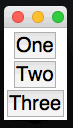

```python
    from appJar import gui

    # the title of the button will be received as a parameter
    def press(btn):
        print(btn)

    app=gui()
    # 3 buttons, each calling the same function
    app.addButton("One", press)
    app.addButton("Two", press)
    app.addButton("Three", press)
    app.go()
```

####Add Buttons

* `.addButton(title, function)`  
    Add a single button to the GUI, the text on the button will be the same as the button's title.  
    A function should be specified, which will be called when the button is clicked, where the title is passed as a parameter to the function.  
    Alternatively, the function can have no parameter, and appJar will not supply an argument.     

* `.addButtons(titles, functions)`  
    It's possible to add a list of buttons to the GUI.  
    Pass a 1-dimensional or 2-dimensional list, and they will be rendered accordingly.  
    A single function can be passed, to use for all buttons.  
    Or a list of functions can be passed, which MUST correspond to the buttons.  

* `.addImageButton(title, function, imgFile, align=None)`  
    This creates the named button, as above, using the specified image.  
    If align is set, the image will be aligned relative to the text, otherwise the image will replace the text.  

* `.addIconButton(title, function, iconName, align=None)`  
    This creates the named button, as above, using the specified icon.  
    If align is set, the image will be aligned relative to the text, otherwise the image will replace the text.  

* `.addNamedButton(name, title, function)`  
    By default, it's not possible to have two buttons with the same text.  
    If that's required, a named button should be used.  
    This allows a name and title to be set for a button.  
    The name will be displayed on the button, and the title passed to the function.

####Set Buttons
* `.setButton(name, text)`  
    This will change the text displayed on a button, but **NOT** the value passed as a parameter to the function.  

* `.setButtonImage(title, image, align=None)`  
    This allows an image to be placed on a button, instead of the usual text.  
    If align is set, the image will be aligned relative to the text, otherwise the image will replace the text.  

##RadioButton
____
A group of round boxes, only one of which can be selected.  
These are great for getting a single value, for a multiple choice question.  

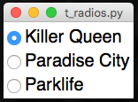  

```python
from appJar import gui

app=gui()
app.addRadioButton("song", "Killer Queen")
app.addRadioButton("song", "Paradise City")
app.addRadioButton("song", "Parklife")
app.go()
```

####Add RadioButtons
* `.addRadioButton(title, name)`  
    This will create a RadioButton grouped by the specified title.  
    This button will have the value of name.  
    Radio buttons are usually used in groups.  

####Set RadioButtons
* `.setRadioButton(title, value, callFunction=True)`  
    This will tick the specified RadioButton.  
    Set ```callFunction``` to be False, if you don't want to call any associated functions.  

* `.setRadioTick(title, tick=True)`  
    It is possible to use tick-boxes instead of the classic circular radio-button.  
    Setting tick to True will convert all the radio-buttons for this title to tick boxes.  

* `.clearAllRadioButtons(callFunction=False)`  
    This will reset all RadioButtons in the app to their first value.  
    Set ```callFunction``` to be True, if you want to call any associated functions.  

####Get RadioButtons
* `.getRadioButton(title)`  
    Gets the value of the selected RadioButton, for the specified title.
```python
    from appJar import gui

    def press(rb):
        print(app.getRadioButton("song"))

    app=gui()
    app.addRadioButton("song", "Killer Queen")
    app.addRadioButton("song", "Paradise City")

    # call this function, when the RadioButton changes
    app.setRadioButtonChangeFunction("song", press)

    app.addButton("PLAY", press)
    app.go()
```

* `.getAllRadioButtons()`  
    This will return the contents of all RadioButtons in the app, as a dictionary.  

##CheckBox
____
A simple tick-box, with a label, that can be either ON or OFF.  

  

```python
from appJar import gui

app=gui()
app.setFont(20)

app.addCheckBox("Apples")
app.addCheckBox("Pears")
app.addCheckBox("Oranges")
app.addCheckBox("Kiwis")

app.setCheckBox("Oranges")

app.go()
```

####Add CheckBoxes
* `.addCheckBox(title)`  
    This creates a CheckBox, with the specified title.  

* `.addNamedCheckBox(name, title)`  
    By default, it's not possible to have two CheckBoxes with the same text.  
    If that's required, a named CheckBox should be used.  
    This creates a CheckBox, with the specified title.  
    The name will be displayed next to the CheckBox, and the title passed to the function as a unique ID.  

####Set CheckBoxes

* `.setCheckBox(title, ticked=True, callFunction=True)`  
    This will tick the CheckBox, or untick it if ticked is set to False.  
    Set ```callFunction``` to be False, if you don't want to call any associated functions.  

* `.clearAllCheckBoxes(callFunction=False)`  
    This will clear (untick) all CheckBoxes in the app.  
    Set ```callFunction``` to be True, if you want to call any associated functions.  

####Get CheckBoxes

* `.getCheckBox(title)`  
    This will return True or False, depending on the state of the CheckBox.  

* `.getAllCheckBoxes()`  
    This will return the contents of all CheckBoxes in the app, as a dictionary.  

##OptionBox
____
Creates a simple drop-down box.  
It is only possible to select one option from this drop-down.  
Pass in a list of values to show in the drop-down box.  
They will be added in the same order, with the first item shown.  
If the first item is empty, a simple title `- options -` will be created.  
Any other empty items will be removed.  
If an item starts with a dash (-), it will be treated as a separator, and can't be selected.  

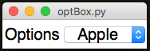 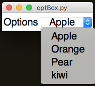  

```python
from appJar import gui

app=gui()
app.setFont(20)
app.addLabelOptionBox("Options", ["- Fruits -", "Apple", "Orange",
                        "Pear", "kiwi", "- Pets -", "Dogs", "Cats",
                        "Fish", "Hamsters"])
app.go()
```

####Add OptionBoxes
* `.addOptionBox(title, values)`  
    This will create an OptionBox, adding the contents of the values list, in the order specified.  

* `.addTickOptionBox(title, values)`  
    This will create an OptionBox made up of check boxes.  
    The `title` will always be displayed as the *selected* entry in the OptionBox, event though it can't be selected/ticked.  
    Instead of selecting a single item, you tick the ones you want.  
    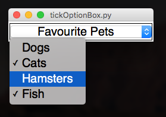  

    Calling `.getOptionBox(title)` will return a dictionary of the options along with a True/False value.  

```python
from appJar import gui

def get(btn):
    print(app.getOptionBox("Favourite Pets"))

app=gui()
app.setFont(20)
app.addTickOptionBox("Favourite Pets", ["Dogs", "Cats", "Hamsters", "Fish"])
app.addButton("GET", get)
app.go()
```

####Set OptionBoxes
* `.changeOptionBox(title, newOptions, index, callFunction=False)`  
    This will replace the contents of the OptionBox, with the new list provided.  
    If specified, the indexed item will be selected - this can be a position or an item name.  
    If setting a TickOptionBox, the old list will be replaced with the new list. None will be ticked. `index` will be ignored.  
    Set ```callFunction``` to be True, if you want to call any associated `change` functions.  

* `.setOptionBox(title, position, value=True, callFunction=True, override=False)`  
    This will select the item in the list, at the position specified.  
    Alternatively, the name of an item can be specified.  
    If changing a TickOptionBox, the specified item will be set to the specified value.  
    Set ```callFunction``` to be False, if you don't want to call any associated functions.  
    By default, you can't select a disabled item. You can change this by setting `override` to be True.  

* `.renameOptionBoxItem(title, item, newName, callFunction=False)`  
    This will rename the specified item in the named OptionBox.  
    Set ```callFunction``` to be True, if you want to call any associated `change` functions.  

* `.clearOptionBox(title, callFunction=True)`  
    This will set the named OptionBox back to its first value (even if it's disabled).  
    Set ```callFunction``` to be False, if you don't want to call any associated functions.  

* `.clearAllOptionBoxes(callFunction=False)`  
    This will set all OptionBoxes in the app back to their first value (even if it's disabled).  
    Set ```callFunction``` to be True, if you want to call any associated functions.  

* `.deleteOptionBox(title, position)`  
    This will delete the item in the list, at the position specified.  
    Alternatively, the name of an item can be specified.  
    Not available on TickOptionBoxes.  

####Get OptionBoxes

* `.getOptionBox(title)`  
    This will return the currently displayed value in an OptionBox.  
    Or a dictionary of names, and their boolean value if a TickOptionBox.  
    Will return None, if an invalid option is currently selected.  

* `.getAllOptionBoxes()`  
    This will return the contents of all OptionBoxes in the app, as a dictionary.  

##SpinBox
____
A scrollable list of options. Up and down buttons are provided to scroll from one item to the next.  
Unlike the OptionBox, you do not get a drop-down of choices, instead it spins to the next/previous option.  

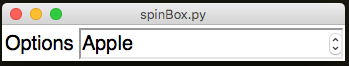  

```python
from appJar import gui

app=gui()
app.setFont(20)
app.addLabelSpinBox("options", ["Apple", "Orange", "Pear", "kiwi"])
app.go()
```

####Add SpinBoxes
* `.addSpinBox(title, values)`  
    This will create a SpinBox, adding the contents of the values list, in the order specified.

* `.addSpinBoxRange(title, from, to)`  
    This will create a SpinBox, with a numeric range of items.  

    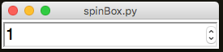  

```python
    from appJar import gui

    app=gui()
    app.setFont(20)
    app.addSpinBoxRange("Numbers", 1, 12)
    app.go()
```

####Set SpinBoxes
* `.setSpinBox(title, value, callFunction=True)`  
    This will select the specified value in the SpinBox.  
    Set ```callFunction``` to be False, if you don't want to call any associated functions.  

* `.setSpinBoxPos(title, pos, callFunction=True)`  
    This will select the value at the specified position in the SpinBox.  
    Set ```callFunction``` to be False, if you don't want to call any associated functions.  

* `.clearAllSpinBoxes(callFunction=False)`  
    This will set all SpinBoxes in the app to their first value.  
    Set ```callFunction``` to be True, if you want to call any associated functions.  

####Get SpinBoxes

* `.getSpinBox(title)`  
    This will get the selected value from the specified SpinBox.  

* `.getAllSpinBoxes()`  
    This will return the contents of all SpinBoxes in the app, as a dictionary.  

---
<div style='text-align: center;'>
*Advertisement&nbsp;<sup><a href="/advertising">why?</a></sup>*
<script async src="//pagead2.googlesyndication.com/pagead/js/adsbygoogle.js"></script>
<ins class="adsbygoogle"
    style="display:block"
    data-ad-format="fluid"
    data-ad-layout-key="-gw-13-4l+6+pt"
    data-ad-client="ca-pub-6185596049817878"
    data-ad-slot="5627392164"></ins>
<script>(adsbygoogle = window.adsbygoogle || []).push({});</script>
</div>
---

##ListBox
---

A box containing a list of items, single or multi-select

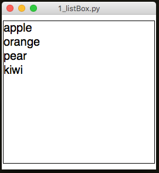  

```python
from appJar import gui

app=gui()
app.setFont(20)
app.addListBox("list", ["apple", "orange", "pear", "kiwi"])
app.go()
```

####Add ListBoxes
* `.addListBox(title, values)`  
    Creates a ListBox with the specified values.  

* `.addListItem(title, item)`  
    Adds a single item to the the end of the ListBox, and selects it.  

* `.addListItems(title, items)`  
    Adds a list of items to the end of the List Box, selecting the last one.  

####Set ListBoxes
* `.setListItem(title, item, newVal, first=False)`  
    `.setListItemAtPos(title, pos, newVal)`  
    Changes the specified list item to the new value.  
    If `first` is set to True, only the first item found will be changed.  
    Otherwise, all occurrences of the specified value will be changed.  

* `.removeListItem(title, item)`  
    `.removeListItemAtPos(title, pos)`  
    Remove the specified item from the  specified ListBox.  
    Will only remove the first item that matches the parameter.  

* `.clearListBox(title, callFunction=True)`  
    Removes all items from the specified ListBox.  
    Set ```callFunction``` to be False, if you don't want to call any associated functions.  

* `.clearAllListBoxes(callFunction=False)`  
    This will remove all items from all ListBoxes in the app.  
    Set ```callFunction``` to be True, if you want to call any associated functions.  

* `.updateListBox(title, items, select=False)`  
    Replace the contents of the specified ListBox with the new values.  
    If you set `select` to be True, the last item in the list will be selected.  

```python
from appJar import gui
def press(btn):
    items = app.getListItems("list")
    if len(items)> 0:
        app.removeListItem("list", items[0])

app=gui()
app.setFont(20)
app.addListBox("list", ["apple", "orange", "pear", "kiwi"])
app.addButton("press",  press)
app.go()
```

* `.selectListItem(title, item, callFunction=True)`  
    `.selectListItemAtPos(title, pos, callFunction=False)`  
    Selects the specified item in the specified ListBox.  
    Set ```callFunction``` to be False, if you don't want to call any associated functions.  

* `.setListBoxRows(title, rows)`  
    Sets how many rows to display in the specified ListBox.  

* `.setListBoxMulti(list, multi=True)`  
    Configures whether the specified ListBox is single or multi select.  

* `.setListBoxGroup(list, group=True)`  
    Adds the named ListBox to a group of selectable ListBoxes.  
    All ListBoxes in the group can have items selected at the same time.  

* `.setListItemBg(title, item, colour)` & `.setListItemFg(title, item, colour)`  
    `.setListItemAtPosBg(title, item, colour)` & `.setListItemAtPosFg(title, item, colour)`  
    Sets the background or foreground colours the specified ListBox item.  
    Can either specify a named item (will update all with that name) or the position of an item.  

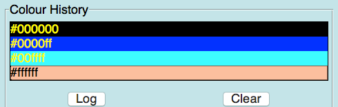  

####Get ListBoxes

* `.getListBox(title)`  
    Gets all of the selected items from the specified ListBox.  

* `.getAllListBoxes()`  
    This will return the contents of all ListBoxes in the app, as a dictionary.  

* `.getAllListItems(title)`  
    Gets all of the items from the specified ListBox.  

##Scale
____
A slider, that has a minimum & maximum value.  

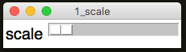  

```python
from appJar import gui

app=gui()
app.setFont(20)
app.addLabelScale("scale")
app.go()
```

####Add Scales
* `.addScale(title)`  
    Adds a horizontal scale, with a default range between 0 and 100.  

####Set Scales
* `.setScale(title, pos, callFunction=True)`  
    Sets the selected pos for the specified Scale.  
    Set ```callFunction``` to be False, if you don't want to call any associated functions.  

* `.setScaleRange(title from, to, curr=None)`  
    Allows you to change the range available in the Scale.  
    If ```curr``` is provided, then the Scale will be set to that value.  

* `.setScaleIncrement(title, increment)`  
    Configures how much the scale jumps, when the trough is clicked.  
    It defaults to 10%.  

* `.showScaleIntervals(title, intervals)`  
    Configures the Scale to show interval labels along its length.  
    `intervals` should be how often to show a value, eg. `25` would show 0, 25, 50, and so on...  
    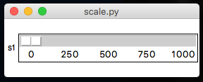  

* `.showScaleValue(title, show=True)`  
    Configures the Scale to show the currently selected value.  
    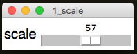  

* `.setScaleHorizontal(title)` & `.setScaleVertical(title)`  
    Changes the Scale's orientation to the specified value.  

    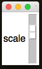  

* `.setScaleWidth(title, width)` & `.setScaleLength(title, length)`  
    Sets a width/length for the scale's slider.  

* `.setScaleChangeFunction(title, func)`  
    Sets a function to call, each time the scale is changed.  
    The function must take one parameter, which will be populated with the scale's title.  

* `.clearAllScales(callFunction=False)`  
    This will set all Scales in the app to their minimum value.  
    Set ```callFunction``` to be True, if you want to call any associated functions.  

####Get Scales

* `.getScale(title)`  
    Gets the currently selected value from the scale.  

* `.getAllScales()`  
    This will return the contents of all Scales in the app, as a dictionary.  

##Message
____
Similar to a Label, except it will wrap the text over multiple lines.  

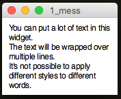  

```python
from appJar import gui

app=gui()
app.setFont(12)
app.addMessage("mess", """You can put a lot of text in this widget.
The text will be wrapped over multiple lines.
It's not possible to apply different styles to different words.""")
app.go()
```

####Add Messages
* `.addMessage(title, text)`  
    Adds a Message widget, with the specified text.  
    If not text is provided, the title will be used for the text.  

* `.addEmptyMessage(title)`  
    Adds an empty Message widget.  

####Set Messages
* `.clearMessage(title)`  
    Clears the specified Message widget.  

* `.setMessage(title, text)`  
    Sets the contents of the specified Message widget, to the specified text.  

##TextArea
____
Similar to an Entry, but allows you to type text over multiple lines.  

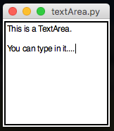  

```python
from appJar import gui

app=gui()
app.addTextArea("t1")
app.go()
```

####Add TextAreas
* `.addTextArea(title)`  
    Adds an empty TextArea, with the specified title.  

* `.addScrolledTextArea(title)`  
    Adds a scrollable TextArea with the specified title.  

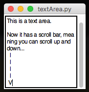  

####Set TextAreas
* `.setTextArea(title, text, end=True, callFunction=True)`  
    Adds the supplied text to the specified TextArea.  
    By default, the text is added to the end.  
    Set `end` to be False if you want to add at the beginning.  
    Set ```callFunction``` to be False, if you don't want to call any associated functions.  

* `.clearTextArea(title, callFunction=True)`  
    Clears the contents of the specified TextArea.  
    Set ```callFunction``` to be False, if you don't want to call any associated functions.  

* `.clearAllTextAreas(callFunction=False)`  
    This will clear the contents of all TextAreas in the app.  
    Set ```callFunction``` to be True, if you want to call any associated functions.  

####Get TextAreas

* `.getTextArea(title)`  
    Gets the contents of the specified TextArea.  

* `.getAllTextAreas()`  
    This will return the contents of all TextAreas in the app, as a dictionary.  

---
<div style='text-align: center;'>
*Advertisement&nbsp;<sup><a href="/advertising">why?</a></sup>*
<script async src="//pagead2.googlesyndication.com/pagead/js/adsbygoogle.js"></script>
<ins class="adsbygoogle"
    style="display:block"
    data-ad-format="fluid"
    data-ad-layout-key="-gw-13-4l+6+pt"
    data-ad-client="ca-pub-6185596049817878"
    data-ad-slot="5627392164"></ins>
<script>(adsbygoogle = window.adsbygoogle || []).push({});</script>
</div>
---

##Meter  
---

Various styles of progress meter:  

* #### Meter  

    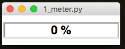  
    A simple meter for showing progress from 0% to 100%.  

* #### SplitMeter  

    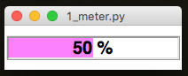  
    A possession style meter, showing percentages on either side.  

* #### DualMeter  

    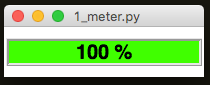  
    Two separate meters, expanding out from the middle.  

```python
from appJar import gui

app=gui()
app.addMeter("progress")
app.setMeterFill("progress", "blue")
app.go()
```

####Add Meters
* `.addMeter(name)` & `.addSplitMeter(name)` &  `.addDualMeter(name)`  
    Adds a meter with the specified name, of the specified type.  
####Set Meters
* `.setMeter(name, value, text=None)`  
    Changes the specified meter to the specified value.  
    For `Meter` & `SplitMeter`should be a value between 0 and 100.  
    For `DualMeter` should be a list of two values, each between 0 and 100.  

* `.setMeterFill(name, colour)`  
    Changes the fill colour of the specified meter.  
    For `SplitMeter` & `DualMeter`should be a list of two colours.  

####Get Meters

* `.getMeter(name)`  
    Gets the value of the specified meter.  
    As meters convert their data to a value between 0 and 1, this will return a list of two values: `(0.45, '45 %')`  

* `.getAllMeters()`  
    This will return the contents of all Meters in the app, as a dictionary.  

####Background Processing  
Meters are designed to show progress over time.  
One common solution is to register a function that is constantly updating a meter.  
This should then be monitoring/updating a global variable:  

```python
def updateMeter():
    app.setMeter("progress", percentComplete)

# schedule function to be called regularly
app.registerEvent(updateMeter)
```

##Properties
____
A compound widget that shows multiple CheckButtons linked to a dictionary.  
Note, dictionaries have no order, so when added as a dictionary, the items will be automatically sorted.  

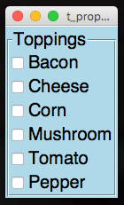
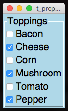

```python
from appJar import gui

toppings={"Cheese":False, "Tomato":False, "Bacon":False,
            "Corn":False, "Mushroom":False}

app=gui()
app.setBg("lightBlue")
app.setFont(20)
app.addProperties("Toppings", toppings)
app.setProperty("Toppings", "Pepper")
app.go()
```

####Add Properties
* `.addProperties(title, values)`  
    Creates a new Properties widget, with the specified title.  
    If values is populated, then the dictionary items will be added to the widget.  

####Set Properties

* `.setPropertyText(title, prop, newText=None)`  
    Change the displayed text for the named property.  
    If no value is provided, the original value will be used.  

* `.setProperties(title, props, callFunction=True)`  
    Adds the dictionary of properties to the widget.  
    If any of them already exist, they will be updated.  
    Set ```callFunction``` to be False, if you don't want to call any associated functions.  

* `.setProperty(title, prop, value=False, callFunction=True)`  
    Sets the named property to the specified value.  
    If it doesn't exist, it will be added first, at the end of the widget.  
    Set ```callFunction``` to be False, if you don't want to call any associated functions.  

* `.deleteProperty(title, prop)`  
    Deletes the named property from the widget.  

* `.resetProperties(title, callFunction=True)`  
    This will reset the specified Properties back to its original values.  
    Set ```callFunction``` to be False, if you don't want to call any associated functions.  

* `.clearProperties(title, callFunction=True)`  
    This will set all values in the specified Properties to False.  
    Set ```callFunction``` to be False, if you don't want to call any associated functions.  

* `.resetAllProperties(callFunction=False)`  
    This will reset all Properties in the app back to their original values.  
    Set ```callFunction``` to be True, if you want to call any associated functions.  

* `.clearAllProperties(callFunction=False)`  
    This will set all values in all Properties in the app to False.  
    Set ```callFunction``` to be True, if you want to call any associated functions.  

####Get Properties

* `.getProperties(title)`  
    Gets a dictionary of the all items in the Properties widget.  

* `.getAllProperties()`  
    This will return the contents of all Properties in the app, as a dictionary.  

* `.getProperty(title, prop)`  
    Gets the value of the named property.  

####Examples
It's possible to put Properties into ToggleFrames, and also set a Function to listen for any changes.  

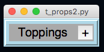

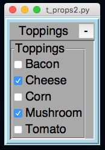

```python
from appJar import gui

def changed(props):
    print("Changed", props)

toppings={"Cheese":False, "Tomato":False, "Bacon":False,
            "Corn":False, "Mushroom":False}

app=gui()
app.setBg("lightBlue")
app.setFont(20)

app.startToggleFrame("Toppings")
app.addProperties("Toppings", toppings)
app.setPropertiesChangeFunction("Toppings", changed)
app.stopToggleFrame()

app.go()
```

##Separator
____
Useful for indicating separation between widgets.  
Will draw a horizontal/vertical line spanning the cell.  
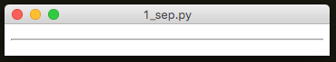  

```python
from appJar import gui

app=gui()
app.setBg("lightBlue")
app.addHorizontalSeparator(0,0,4, colour="red")
app.addVerticalSeparator(1,0, colour="red")
app.addVerticalSeparator(1,1, colour="red")
app.addVerticalSeparator(1,2, colour="red")
app.addVerticalSeparator(1,3, colour="red")
app.addHorizontalSeparator(2,0,4, colour="red")
app.go()
```

####Add Seperators

* `.addHorizontalSeparator(colour=None)` & `.addVerticalSeparator(colour=None)`  
    Adds a separator (a horizontal or vertical line) spanning the cell.  
    An optional colour can be passed in, to set a colour for the separator.  

##Link/WebLink
____
Clickable text to call a function or launch a URL

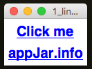  

```python
from appJar import gui
def press(link):
    app.infoBox("Info", "You clicked the link!")

app=gui()
app.setFont(20)
app.addLink("Click me", press)
app.addWebLink("appJar.info", "http://appJar.info")
app.go()
```

####Add Links

* `.addLink(title, func)`  
    Adds a **hyperlink**, that when clicked, will call the specified function.  

* `.addWebLink(title, page)`  
    Adds a **hyperlink**, that when clicked, will launch the default browser, and load the specified page.  
    It must be a fully formed link, including ```http://```  

##Grip
____
Clickable icon to drag the window around.  

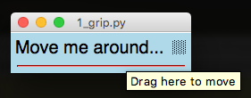  

```python
from appJar import gui

app=gui()
app.setFont(20)
app.setBg("lightBlue")

app.addLabel("l1", "Move me around...", 0, 0)
app.addGrip(0,1)
app.addSeparator(1,0,2, colour="red")
app.go()
```
####Add Grips

* `.addGrip()`  
    Adds a simple grip icon.  
    The mouse pointer changes over the grip, and a ToolTip will be shown.  
    The size and image can't be changed.  

##DatePicker
---
A widget to capture a date - will handle presenting accurate drop-downs, and return a date.  
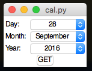  

```python
from appJar import gui

def showDate(btn):
    print(app.getDatePicker("dp"))

app=gui()
app.addDatePicker("dp")
app.addButton("GET", showDate)
app.setDatePickerRange("dp", 1900, 2100)
app.setDatePicker("dp")
app.go()
```
####Add DatePickers  

* `.addDatePicker(title)`  
    Create a DatePicker, with a range from 1/1/1970 to 31/12/2020  

####Set DatePickers  

* `.setDatePicker(title, date=None)`  
    Will set the specified DatePicker to the specified date, or current date if no date is supplied.  

* `.setDatePickerRange(title, startYear, endYear=None)`  
    Set the range for the named DatePicker.  
    If endYear is None, the current Year will be used.  

* `.setDatePickerChangeFunction(title, function)`  
    Set a function to call when the DatePicker is changed.  

* `.clearDatePicker(title, callFunction=True)`  
    This will reset the specified DatePicker to the earliest available date.  
    Set ```callFunction``` to be False, if you don't want to call any associated functions.  

* `.clearAllDatePickers(callFunction=False)`  
    This will reset all DatePickers in the app to their earliest available date.  
    Set ```callFunction``` to be True, if you want to call any associated functions.  

####Get DatePickers  

* `.getDatePicker(title)`  
    Will return the currently selected date.  

* `.getAllDatePickers()`  
    This will return the contents of all DatePickers in the app, as a dictionary.  
