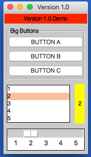

# v1.0 Naming  

One of the features we are working towards in the 1.0 release, is a simplified way of adding, setting & getting widgets.  
Each widget will have a single function that supports all three actions.  

If you combine this with the [context manager](/pythonContextManager) feature, this becomes possible:

```python
from appJar import gui 

def press(btnName):
    app.popUp("INFO", "You pressed " + btnName)

def update(value):
    if value == "list": app.slider("slider", app.listbox(value)[0])
    elif value == "slider": app.listbox("list", app.slider(value))
    app.label("display", app.listbox("list")[0])

with gui("Version 1.0", bg="teal") as app:
    app.label("Version 1.0 Demo", colspan=2, bg="red")
    with app.labelFrame("Big Buttons", colspan=2, sticky="news", expand="both"):
        app.button("BUTTON A", press)
        app.button("BUTTON B", press)
        app.button("BUTTON C", press)
    app.listbox("list", [1, 2, 3, 4, 5], rows=5, selected=0, submit=update)
    app.label("display", "1", row=2, column=1, bg="yellow", sticky="news")
    app.slider("slider", colspan=2, range=(1,5), change=update, interval=1)
```



## Operation  
---
As demonstrated above, each widget now has a single function - the name of the widget.  
Call this function passing one or both of the key parameters, to determine what should happen:

```python
app.label("title", "text")      # ADD a label if the title is new
app.label("title", "text_2")    # SET a label if the title already exists
print(app.label("title"))       # GET a label if no widget is being added or set
```  

### Key Parameters  

The two key parameters are:

| Parameter | Data type | Description |
| --------- | --------- | ------------|
| title | string | A unique identifier for that widget type. |
| value | string | Any relevant information for the widget. |

The logic is as follows:

* If `title` doesn't exist - **ADD** the widget, using the `value`, or `title` if no `value` is specified.  
* If `title` already exists and a `value` is specified - **SET** the widget (either the values or state).  
* If `title` already exists and a `value` is not specified - **GET** the widget.  

### Positional Parameters  

When adding a widget, it is positioned in the first column of a new row.  
If you want to change this, you can specify where it should go, either by naming the paramters:  

```python
app.label("title", "text", row=2, column=4, rowspan=3)      # ADD a label
```

Or by passing them as a tuple:  

```python
app.label("Main Title", pos=(1, 0))     # ADD a label in row 1, column 0
app.label("Sub Title", pos=(2, 0, 2))   # ADD a label in row 2, column 0, spanning 2 columns
```

| Parameter | Data type | Default | Description |
| --------- | --------- | ------- | ------------|
| row | integer | &lt;next row&gt; | The grid row to place the widget in. |
| column | integer | 0 | The grid column to place the widget in. |
| rowspan | integer | 1 | The number of grid rows to stretch the widget across. |
| colspan | integer | 1 | The number of grid columns to stretch the widget across. |
| pos | list/tuple | () | Position parameters for the widget, in the order: row, column, colspan, rowspan |

### GUI Parameters    

There are two GUI parameters which affect how widgets are displayed `sticky` and `stretch`.  
These can be modified when adding a widget, just bear in mind they are GUI settings, and will affect all future widgets in the current container.  

```python
app.label("Title", sticky="", stretch="none")
app.label("SubTitle", sticky="ns", stretch="row")
```

| Parameter | Data type | Default | Description |
| --------- | --------- | ------- | ------------|
| sticky | string | &lt;varies&gt; | Describes which sides the widget will stick to, one or more of: `n`, `e`, `w`, `s` in a single string. |
| stretch | string | &lt;varies&gt; | Describes how the widget will stretch to fill the row/column: `none`, `row`, `column` or `all`. |

### Event Parameters  

Most of the widgets also have some support for events (see the [events page](/pythonEvents/#types-of-event) for more information).  
`submit` & `change` will pass the name of the widget to the function, `drop` will pass the data to the function:  
**NB.** the parameter should only be the name of the function, don't include any brackets.  

```python
def update(name):
    if name == "size":
        updateSize()
    elif name == "toppings":
        updateToppings()

app.listbox("size", ["small", "medium", "large"], change=update)
app.listbox("toppings", ["corn", "cheese", "peppers"], change=update)
app.image("img1", "placeholder.gif", drop=True)
```

| Parameter | Data type | Default | Description |
| --------- | --------- | ------- | ------------|
| change | function | None | A function to call when the widget is *changed*. |
| callFunction | boolean | True | Set this to False, when *setting* the widget to stop the `change` function form being called. |
| submit | function | None | A function to call when the widget is *submitted*. |
| over | function (list) | None | A function to call when the mouse *enters* the widget, with an optional second function to call when the mouse *leaves*. |
| drop | boolean/function | None | Update the widget with *dropped* data if True, otherwise call the function. |
| drag | function (list) | None | A function to call call when the widget is *dragged*, with an optional second function to call when the widget is *dropped*. |  

### Other Parameters    

There are a couple of other parameter that can be set on widgets.  

| Parameter | Data type | Default | Description |
| --------- | --------- | ------- | ------------|
| label | boolean/string | False | Adds a Label before the widget (only some input widgets), either the label's title or the the text of this parameter. |
| right | string | None | Specify a premade right-click menu to link to the widget. |
| font | integer/dict | None |  Pass either a font size, or a dictionary of font properties to use for this widget's font. |

## Label  
----

A widget for displaying text in the GUI.  

* `.label(title, value=None)`  
The `value` will be the text to show in the label.  
Labels can receive a `submit` parameter, making them clickable.  
Labels can receive `drop` data.  

| Parameter | Data type | Default | Description |
| --------- | --------- | ------- | ------------|
| kind | string | `standard` | Set to `selectable` or `flash` to add different kinds of labels. |


## Message 
A widget for displaying multi-line text in the GUI.  
Will automatically wrap the text, based on either the `aspect` or `width` settings, defaulting to 50% wider than tall.  

* `.message(title, value=None)`  
    The `value` will be the text to show in the message.  
    Messages can receive `drop` data.  

| Parameter | Data type | Default | Description |
| --------- | --------- | ------- | ------------|
| aspect | integer | 150 | Set the ratio between the width & height. |
| width | integer| None |  Set the number of characters per line. If None, then the aspect is used to calculate the width. |

## Entry  
---
An interactive widget, for capturing user input in the GUI.  

* `.entry(title, value=None)`  
    A `value` is not required, but if provided will populate the entry.  
    Entries can receive a `change` parameter, and can link a `submit` parameter to pressing <ENTER>.  
    Entries can receive `drop` data.  

| Parameter | Data type | Default | Description |
| --------- | --------- | ------- | ------------|
| label | boolean/string | False | Adds a Label before the widget, either the label's title or the the text of this parameter. |
| kind | string | `standard` | One of: `standard`, `file`, `directory`, `numeric`, `auto` or `validation`. |
| secret | boolean | False | Configures the entry box to show stars instead of characters. |
| default | string | None | Sets default text to display in an empty entry. |
| focus | boolean | False | Should the entry box be given focus? |
| rows | integer | 10 | If the kind is `auto` this will set the number of rows to show. |
| labBg | string | None | Special parameter to change the BG of the validation label in a validaiton entry. |

There are also some validation settings that can be applied:  

| Parameter | Data type | Default | Description |
| --------- | --------- | ------- | ------------|
| limit | integer | None | Sets a maximum limit on the number of characters that can be entered. |
| case | string | None | Set to `upper` to force uppercase or `lower` to force lowercase. |

## Text  
---
An interactive widget, for capturing multi-line user input in the GUI.  

* `.text(title, value=None)`  
    A `value` is not required, but if provided will populate the text.  
    Text boxes can receive a `change` parameter.  
    Text boxes can receive `drop` data.  

| Parameter | Data type | Default | Description |
| --------- | --------- | ------- | ------------|
| scroll | boolean | False | Will configure this as a scrollable text area. |

## Button  
---

A clickable button for triggering events.  

* `.button(title, value=None)`  
    The `value` should be a function to call when the button is pressed.  

| Parameter | Data type | Default | Description |
| --------- | --------- | ------- | ------------|
| image | string | None | A path to an image to show in the button. |
| icon | string | None | The name of an icon to show in the button. |
| label | string | None | Alternative text to display on the button. |

## Link  
---
A clickable **hyperlink** to trigger events or launch webpages.  

* `.link(title, value=None)`  
    The `value` can be set to a function to call when the link is clicked, or a valid URL to open in a browser.  

## Check  
---
A checkbox style widget, that can be checked/unchecked.  

* `.check(title, value=None)`  
    The `value` should be True or False, indicating if the check starts selected or not.  
    Check boxes can receive a `change` parameter.  

## Radio  
---
Radio buttons are used in groups, only one of them can be checked.  
By default, the first radio button added to a group will be selected.

* `.radio(title, value=None)`  
    The `title` is the radio button's group.  
    The `value` is the text to display next to this radio button.  
    Radio buttons can receive a `change` parameter, it will be linked to all radio buttons of the same `title`.  

| Parameter | Data type | Default | Description |
| --------- | --------- | ------- | ------------|
| selected | boolean | False | Should this radio be selected? |

## Option  
---
When clicked, displays a drop-down of items, one of which can be selected.  
Setting this widget won't change the values, but change which one is selected.  

* `.option(title, value=None)`  
    When adding, the `value` should contain a list of items to display in the drop-down.  
    When setting, the `value` should contain the item to select.  
    Options can receive a `change` parameter.  

| Parameter | Data type | Default | Description |
| --------- | --------- | ------- | ------------|
| kind | string | `standard` | Set this to `ticks` if you want tickable options. |
| selected | string/integer | None | Start with the specified item/position selected. |
| checked | boolean | True | When setting the widget, this determines what to do to the specified value. None will delete the value. |
| label | boolean/string | False | Adds a Label before the widget, either the label's title or the the text of this parameter. |
| disabled | string | - | Sets the character used to indicate disabled menu options. |

## Spin  
---
Shows a single value, with arrows to scroll up or down, allowing the user to change the value.  
Setting this widget won't change the values, but change which one is selected.  

* `.spin(title, value=None, endValue=None)`  
    If only the `value` is set, it should be a list of values to display in the spin box.  
    If `endValue` is also set, then both parameters should be integers, and appJar will generate a range of whole numbers between the two values.  
    When setting, the `value` will be selected.  
    Spin boxes can receive a `change` parameter.  

| Parameter | Data type | Default | Description |
| --------- | --------- | ------- | ------------|
| endValue | integer | None | If specified, value & endValue should be integers, and will be used to generate a range. |
| pos | integer | 0 | The position of an item to select. |
| item | string | None | The name of an item to select. |
| label | boolean/string | False | Adds a Label before the widget, either the label's title or the the text of this parameter. |

## Listbox
---

Displays a list of items, one (or more than one) of which can be selected.  
Setting this widget won't change the values, but change which one is selected.  

* `.listbox(title, value=None)`  
    When adding, the `value` should contain a list of items to display in the listbox.  
    When setting, the `value` should contain the item(s) to select.  
    Listboxes can receive a `change` parameter.  
    Listboxes can receive `drop` data.  

| Parameter | Data type | Default | Description |
| --------- | --------- | ------- | ------------|
| rows | integer | None | Specifies how many rows to display in the listbox. |
| multi | boolean | False | Set the listbox to be multi-selectable. |
| group | boolean | False | Set the listbox to be part of a group. |
| selected | int | None | The position to select when the listbox is added. |

## Slider  
---
A draggable widget, where the user can select a number from a range.  

* `.slider(title, value=None)`  
    The `value` is optional - it will set the starting position of the slider.  
    Sliders can receive a `change` parameter.  

| Parameter | Data type | Default | Description |
| --------- | --------- | ------- | ------------|
| direction | string | `horizontal` | Set the direction of the slider: `vertical` or `horizontal`. |
| show | boolean | False | Show the slider's value above the slider. |
| increment | integer | 10 | Configures how much the slider jumps, when the trough is clicked. |
| interval | integer | None | Configures the slider to show values, along its length, in steps of the value specified. |
| label | boolean/string | False | Adds a Label before the widget, either the label's title or the the text of this parameter. |

## Meter  
---
Various styles of progress meter.  

* `.meter(title, value=None)`  
    For `standard` and `split` meters `value` should be a number between 0 and 100.  
    For `dual` meters, `value` should be a list of two numbers, each between 0 and 100.  

| Parameter | Data type | Default | Description |
| --------- | --------- | ------- | ------------|
| text | string | None | Set text to show on the meter. |
| kind | string | `standard` | Choose the kind of meter: `standard`, `split` or `dual`. |
| fill | boolean | None | Set the fill colour(s) for the slider (a list of two colours for `split` & `dual`). |

## Grip  
---
Displays a draggable icon, which allows the GUI to be moved.  

* `.grip(title, value=None)`  
    A `value` is not required.  

## Separator  
---
Displays a line, giving visual separation in the GUI.  

* `.separator(title, value=None)`  
    A `value` is not required.  

| Parameter | Data type | Default | Description |
| --------- | --------- | ------- | ------------|
| direction | string | horizontal | Set the orientation of the separator: `horizontal` or `vertical`. |

## Image  
---

Displays a picture.  

* `.image(title, value=None)`
    The `value` should be the image file, icon or data to show.  
    Images can receive a `submit` parameter, making them clickable.  
    Images can receive `drop` data.  

| Parameter | Data type | Default | Description |
| --------- | --------- | ------- | ------------|
| kind | string | `standard` | The kind of image, one of: `icon`, `data` or `standard`. |
| fmt | string | None | If the `kind` is `data` this will be used to determine the file type. |
| compound | string | None | Can be set to a position to show the title as well (`top`, `bottom`, `left`, `right` or `center`). |
| speed | integer | None | If this is an animated image, the FPS to animate the image at. |
| over | string | None | The path to an alternative image to show, when the mouse goes over the image. |
| map | dictionary| None | A dictionary of name:coordinates to use as an image map. `submit` must also be set. |

## Properties  
---
Displays a list of checkboxes, stored in a dictionary.  

* `.properties(title, value=None)`
    The `value` should contain a dictionary of names and booleans.  
    Properties can receive a `change` parameter.  

## Date  
---
Displays a simple date picker widget.  

* `.date(title, value=None)`
    The `value` should contain a date object.  
    Date pickers can receive a `change` parameter.  

## Canvas  
---
Displays a canvas widget.  

* `.canvas(title)`
    Adds a canvas with the specified title. 

| Parameter | Data type | Default | Description |
| --------- | --------- | ------- | ------------|
| map | dictionary| None | A dictionary of name:coordinates to use as a canvas map. `submit` must also be set. |

## PopUp  
---

Displays a popUp.  

* `.popUp(title, message, kind="info", parent=None)`  
    This will show any of the available popUps.  
    `title`  will be displayed in the title bar.
    `message` will be displayed as the text of the popUp.  
    `kind` defaults to `info`, but can be any of: `error`, `warning`, `yesno`, `question`, `ok`, `retry`, `string`, `integer`, `float`, `text` or `number`.  
    `parent` allows you to link this popUp to a named SubWindow, instead of the main window.  

## Statusbar
---
* `.statusbar(**kwargs)`  
    Functions to show or update a statusbar.  
    It will add a statusbar if none exists, with the following parameters:  
    * `header` this will set a piece of text to put before any messages.  
    * `fields` this will set the number of fields to show in the statusbar.  
    * `side` this will set whether to show the fields on the `LEFT`, `RIGHT`, or the default `stretched`.  
    * `text` text to put in the first field.  

* `.statusbar(**kwargs)`  
    Or, update the statusbar if one does exist:  
    * `text` text to put in the field.  
    * `field` the field numberis applicable.  

## Toolbar  
---

Displays the toolbar.  

* `.toolbar(names, funcs, **kwargs)`
    `names` should be th elist of button names to display on the toolbar.  
    `funcs` should contain either a single function, that all buttons will be linked to, or a list of functions for each button.

| Parameter | Data type | Default | Description |
| --------- | --------- | ------- | ------------|
| icons | boolean | False | Determines if appJar should try to find icons for each menu item. |
| pinned | boolean | None | If set, the toolbar will be pinnable. Setting to `True` wil start pinned, `False` not pinned. |
| disabled | boolean | False | Determines if the toolbar should start disabed or not. | 
| hidden | boolean | False | Determines if the toolbar should start hidden or not. When hidden it is completley removed from the GUI. | 
