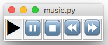
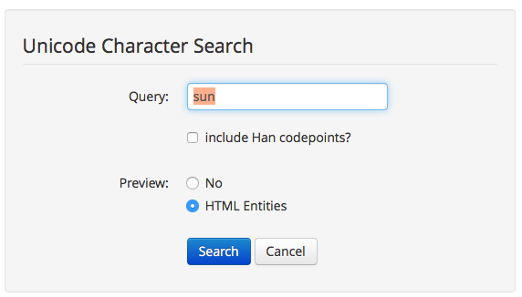
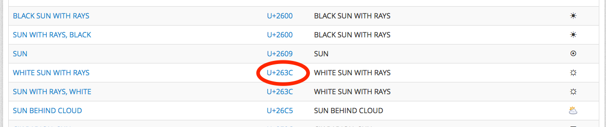
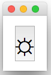

# Special Characters
---

If you've ever tried a [ValidationEntry](/inputWidgets/#entry), you'll notice we use some special characters:


### Explanation
---
You can't find these on the keyboard, so can't type them in your code.  
Instead, you need to use a special code ([unicode](https://en.wikipedia.org/wiki/Unicode)), for the character you want.

For example, Unicode for the tick is ```2714```, and the cross is ```2716```

To represent these in Python, you need to use a special syntax:

```python
TICK="\u2714"
CROSS="\u2716"

app.addLabel("tick", TICK)
app.addLabel("cross", CROSS)
```

By putting `\u` at the start of the String, you tell Python it is a Unicode character.  
This works well in Python 3.x, as it knows what unicode characters are.

If you're still using python 2.x (not recommended), you'll need to use a little extra magic:  

```python
TICK=u"\u2714"
CROSS=u"\u2716"

app.addLabel("tick", TICK)
app.addLabel("cross", CROSS)
```

By also putting a `u` before the string, you tell Python to expect a unicode character.
(In fact, it calls the Unicode function, converting the string data into Unicode.)

---
<div style='text-align: center;'>
*Advertisement&nbsp;<sup><a href="/advertising">why?</a></sup>*
<script async src="//pagead2.googlesyndication.com/pagead/js/adsbygoogle.js"></script>
<ins class="adsbygoogle"
    style="display:block"
    data-ad-format="fluid"
    data-ad-layout-key="-gw-13-4l+6+pt"
    data-ad-client="ca-pub-6185596049817878"
    data-ad-slot="5627392164"></ins>
<script>(adsbygoogle = window.adsbygoogle || []).push({});</script>
</div>
---

### Example
---

As demonstrated above, it's best to define any Unicode characters you want to use as constants, then you can use them in your code just like any other string.  



```python
PLAY  = "\u25B6"  # 23F5 should work...
PAUSE = "\u23F8"
RWD   = "\u23EA"
FWD   = "\u23E9"
STOP  = "\u23F9"

def music(btn):
    if btn == PLAY:
        # play music
    elif btn == PAUSE:
        # pause music

app.setButtonFont(20)
app.addButtons([PLAY, PAUSE, STOP, RWD, FWD], music)
```

### Unicode Search
---

So, now you just need to find the right Unicode...  

Our favourite site is [FileFormat.info](http://www.fileformat.info/info/unicode/char/search.htm):  


Simply type what you are looking for into the search box, and it will give you the best matches:  


Identify the one you want, and take a note of the Unicode: 263C  
(Note, these are hexadecimal codes, so the values will be between 0 and F)  

You can then use this code in your gui:   
```python
FLOWER = "\u263C"
app.addButton(FLOWER, flowerPower)
```

### Important
---
Different platforms will (potentially) display these characters in different ways...  
As you can see in the music example, for some reason, the PLAY character doesn't display like the other characters...  

There is also an issue with Python GUIs in general, where they can't actually (yet) display all of the different Unicode characters.  
If the character has more than 4 digits in its code, it probably won't work.  
You may even get an error similar to: `character is above the range (U+0000-U+FFFF) allowed by Tcl`  
So, make sure you test them!  

### Compatability
---
As you can see, it's hard to make your code work on all versions of Python.  
The switch from Python2 to Python3 caused lots of problems, as the `u` prefix was removed.  
That meant there were two different ways to get unicode to work: Python2: `u'\u23F9'`, Python3: `'\u23F9'`  

As of Python 3.3, the `u` prefix was brought back (although it doesn't do anything), but that still meant Python3.0 to Python3.2 didn't support it.

So, the best solution, if you want your code to work on all versions of Python, is to not use the `u` prefix, and instead change the way Python2 works.  

If you include `from __future__ import unicode_literals` at the start of your code, you can include unicode characters in Python2, without using the `u` prefix - `print('\u23F9')` will then work on every version of python.  

### Easter Egg
---
Try holding the &lt;ALT&gt; key and typing different codes on a Windows computer...  
