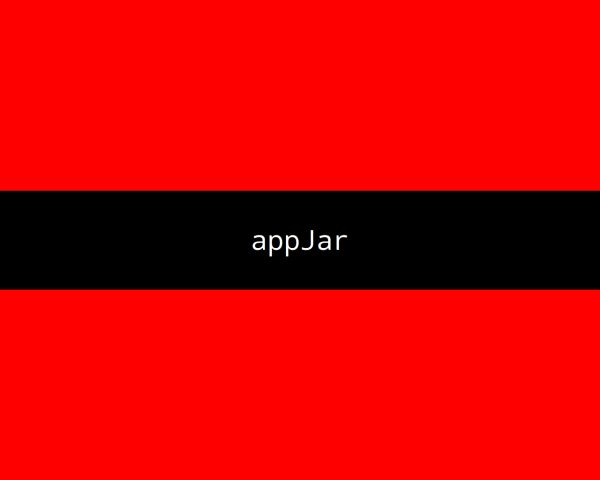

#Splashscreen

It's possible to show a very simple SplashScreen when your GUI starts up.  
It will fill the whole screen, and stay up for a couple of seconds, while your GUI loads.  
  

Simply call:  

* `.showSplash(text, fill='red', stripe='black', fg='white', font=44)`  
    Pass in the text you want to show, plus any colours (not required).  
    `text` This should be a short message to show in the center of the screen.  
    `fill` - this is the bg colour for the splashscreen.  
    `stripe` - this is the bg colour of a stripe across the screen.  
    `fg` - this is the colour of the writing to put in the stripe.  
    `font` - the size of the text.  

This is only a very simple splashScreen, eventually, it will be possible to arrange labels and images in it, just as is possible in the main GUI layout...
