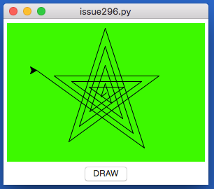

### Turtle ([beta](https://en.wikipedia.org/wiki/Software_release_life_cycle#BETA))  
---
This lets you embed a [turtle](https://docs.python.org/3.6/library/turtle.html) widget in appJar.  

  

```python
from appJar import gui 

def press(b):
    s = app.getTurtleScreen("t1")
    t = app.getTurtle("t1")
    s.bgcolor("blue")
    t.pencolor("white")
    for i in range(20):
        t.forward(i * 10) 
        t.right(144)

app=gui()
app.addTurtle("t1")
app.addButton("DRAW", press)
app.go()
```

* `.addTurtle(title)`  
    Creates a turtle widget.  

* `.getTurtle(title)`  
    Gets the specified turtle widget.  

* `.getTurtleScreen(title)`  
    Gets the screen behind the turtle widget.  
