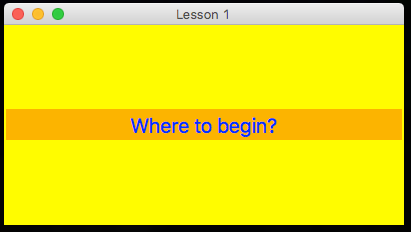
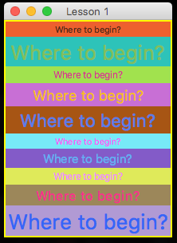
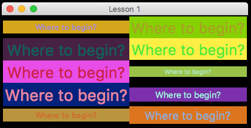
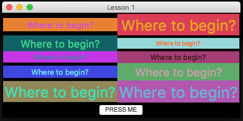

# Getting Started

### Where to start?  
---
To begin with, let's create a GUI with a label:  

  

*The code:*
```python
from appJar import gui

with gui('Lesson 1') as app:
    app.label('Where to begin?')
```

### Add some colour...
---
If we want, we can pass in a lot more information about both the GUI and the label:  

  

*The code:*
```python
from appJar import gui

with gui('Lesson 1', geom='400x200', bg='yellow', fg='blue') as app:
    app.label('Where to begin?', bg='orange', font={'size':20})
```

### More widgets
---

We can then add more labels.  
Unless told otherwise, appJar will add each label on a new line:  

  

*The code:*
```python
from appJar import gui
from random import randint

with gui('Lesson 1', bg='black') as app:
    for x in range(10):
        app.label(str(x), 'Where to begin?',
                    fg=app.RANDOM_COLOUR(), bg=app.RANDOM_COLOUR(),
                    font={'size':randint(10,30)})
```
!!!danger "Widget Names"
    Every widget in appJar needs a unique name. As we have multiple widgets with the same text, we're setting their name to be the loop counter: `str(x)`  
    We've also asked appJar for some random colours.  

### Layout
---

Or, we can tell appJar where to put the label:

  

*The code:*
```python
from appJar import gui
from random import randint

with gui('Lesson 1', bg='black') as app:
    for x in range(10):
        app.label(str(x), 'Where to begin?', pos=[x%5, x%2],
                    fg=app.RANDOM_COLOUR(), bg=app.RANDOM_COLOUR(),
                    font={'size':randint(10,30)})
```
!!!danger "Grid Position"
    The `pos` parameter should contain the row and column.  
    We've used the magic of **MOD**, to set the row to a number between 0 & 4, and the column between 0 & 1.

### A Button
---

Finally, we can add a button to change the labels:

  

*The code:*
```python
from appJar import gui 
from random import randint

def press():
    app.label(str(randint(0, 9)), bg=app.RANDOM_COLOUR(), fg=app.RANDOM_COLOUR())

with gui('Lesson 1', bg='black') as app:
    for x in range(10):
        app.label(str(x), 'Where to begin?', pos=[x%5, x%2],
                    fg=app.RANDOM_COLOUR(), bg=app.RANDOM_COLOUR(),
                    font={'size':randint(10,30)})

    app.button("PRESS ME", press, colspan=2)
```
!!!danger "Widget Names"
    This is why we needed names for each label. Now we can randomly pick a label, and change its colours.  

