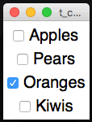

#Widgets
----

Below is a comprehensive list of all the widgets that can be included in a GUI.

They are all used in the same way:

* First, **ADD** a widget
* Then, **SET** any paramters for the widget
* Finally, if needed, **GET** the contents of the widget (usually done in a function)

##Label
____

Labels are used for displaying basic text on the screen.  
  
```python
from rwbatools import gui

app = gui()

app.addLabel("l1", "Label 1")
app.addLabel("l2", "Label 2")
app.addLabel("l3", "Label 3")
app.addLabel("l4", "Label 4")

app.setLabelBg("l1", "red")
app.setLabelBg("l2", "yellow")
app.setLabelBg("l3", "purple")
app.setLabelBg("l4", "orange")

app.go()
```

####Add Labels
* `.addLabel(title, text=None)`  
    At a minimum, a title must be provided - to identify the label. This is then followed by an optional piece of text to display.

* `.addEmptyLabel(title)`  
    Does the same as add a label, except there''s no parameter to set any text.

* `.addFlashLabel(title, text=None)`  
    This adds a flashing label, that will alternate between the foreground and background colours.


####Change Labels
* `.setLabel(title, text)`  
    Change the contents of the label.

* `.clearLabel(title)`  
    Clear the contents of the label.

####Get Labels
* `.getLabel(title)`  
    Get the contents of the label.

##Auto-Labelled Widgets
___

It's possible to autoimatically include a label alongside some widgets.  
Both the label and widget will be placed in the same grid space.  
Simply add the word `Label` to the command when adding the widget:  

* `.addLabelEntry(title)`
* `.addLabelNumericlEntry(title)`
* `.addLabelSecretlEntry(title)`
* `.addLabelOptionBox(title, values)`
* `.addLabelSpinBox(title, values)`
* `.addLabelSpinBoxRange(title, from, to)`  

See the relevant section for a description of what the widget does.

##Entry
____
Entries are used to capture input from the user. They take a single parameter - a title.

There are two special-case entries:

* NumericEntry - this only allows numbrs to be typed in.
* SecretEntry - this will show stars, instead of the letters typed - useful for capturing passwords.


```python
from rwbatools import gui

app=gui()

app.addEntry("e1")
app.addEntry("e2")
app.addEntry("e3")
app.addLabelEntry("Name")

app.setEntryDefault("e2", "Age here")

app.go()
```

####Add Entries

* `.addEntry(title)`
* `.addNumericEntry(title)`
* `.addSecretEntry(title)`

    Each of these will add the specified type of Entry, using the title provided.

#### Change Entries
* `.setEntry(title, text)`  
    This sets the contents of the specified entry box.

* `.setEntryDefault(title, text)`  
    This sets a default value to display in an entry box.  
    Once the user starts typing, it will disappear.  
    The text is centered, shown in a light gray font, and will not be returned by `.getEntry(title)`  

* `.clearEntry(title)`  
    This will clear the contents of the specified entry box.

* `.clearAllEntries()`  
    This will clear all the entry boxes in the GUI.

* `.setFocus(title)`  
    This will put the cursor in the specified entry box, so that the user can start typing without needing to click.

#### Get Entries
* `.getEntry(title)`  
    This will return the contents of the spcified entry box.

##Button
____
A clickable button, that will call a function.  
These are the key to starting an interactive application.  
The GUI is looping, waiting for something to happen.  
A button click is the classic way to start interacting with a GUI.

Whenever any function is called by the GUI, the title of the widget that called it is passed as a parameter.  
That way, multiple widgets can use the same function, but diffrent actions can be performed, depening on the name passed as a parameter.

####Add Buttons

* `.addButton(title, function)`  
    Add a single button to the GUI, the text on the button will be the same as the button's title.  
    A function should be specified, which will be called when the button is clicked.


```python
    from rwbatools import gui
    
    def press(btn):                 # the title of the button will be received as a parameter
        print(btn)

    app=gui()
    app.addButton("One", press)     # 3 buttons, each calling the same function
    app.addButton("Two", press)
    app.addButton("Three", press)
    app.go()
```

* `.addButtons(titles, functions)`  
    It's possible to add a list of buttons to the GUI.  
    Pass a 1-dimensional or 2-dimensional list, and they will be rendered accordingly.
    A single funciton can be passed, to use for all buttons.
    Or a list of functions can be passed, which MUST correspond to the buttons.

* `.addNamedButton(name, title, function)`  
    By default, it's not possible to have two buttons with the same text.  
    If that's required, a named button should be used.  
    This allows a name and title to be set for a button.  
    The name will be displayed on the button, and the title passed to the function.

####Change Buttons
* `.setButton(name, text)`  
    This will change the text displayed on a button, but **NOT** the value passed as a paramter to the function.

* `.setButtonImage(title, image)`  
    This allows an image to be placed on a button, instead of the usual text.

##RadioButton
____
A group of round boxes, only one of which can be selected.  
These are great for getting a single value, for a multiple choice question.

  

```python
from rwbatools import gui

app=gui()
app.addRadioButton("song", "Killer Queen")
app.addRadioButton("song", "Paradise City")
app.addRadioButton("song", "Parklife")
app.go()
```

####Add RadioButtons
* `.addRadioButton(title, name)`  
    This will create a RadioButton grouped by the specified title.  
    This button will have the value of name.  
    Radio buttons are usually used in groups:

####Change RadioButtons
* `.setRadioButton(title, value)`  
    This will tick the specified RadioButton.

* `.setRadioTick(title, tick=True)`  
    It is possible to use tick-boxes instead of the classic circular radio-button.  
    Setting tick to True will convert all the radio-buttons for this title to tick boxes.

####Get RadioButtons
* `.getRadioButton(title)`  
    Gets the value of the selcted RadioButton, for the specified title.
```python
    from rwbatools import gui

    def press(rb):
        print(app.getRadioButton("song"))

    app=gui()
    app.addRadioButton("song", "Killer Queen")
    app.addRadioButton("song", "Paradise City")
    app.setRadioButtonFunction("song", press)   # call this funciton, when the RadioButton changes
    app.addButton("PLAY", press)
    app.go()
```

##CheckBox
____
A simple tick-box, with a label, that can be either ON or OFF.

  

```python
from rwbatools import gui

app=gui()
app.setFont(20)

app.addCheckBox("Apples")
app.addCheckBox("Pears")
app.addCheckBox("Oranges")
app.addCheckBox("Kiwis")

app.setCheckBox("Oranges")

app.go()
```

####Add CheckBoxes
* `.addCheckBox(title)`  
    This creates a CheckBox, with the specified title.

####Change CheckBoxes
* `.setCheckBox(title, ticked=True)`  
    This will tick the CheckBox, or untick it if ticked is set to False.

####Get CheckBoxes
* `.getCheckBox(title)`  
    This will return True or False, depending on the state of the CheckBox.

##OptionBox
____
A drop-down single-select option

####Add OptionBoxes
* `.addOptionBox(title, values)`  
    This will create an OptionBox, adding the contents of the values list, in the order specified.

####Change OptionBoxes
* `.changeOptionBox(title, newOptions)`  
    This will replace the contents of the OptionBox, with the new list provided.

* `.setOptionBox(title, position)`  
    This will select the item in the list, at the position specified.

####Get OptionBoxes
* `.getOptionBox(title)`

##SpinBox
____
A scrollable option

####Add SpinBoxes
* `.addSpinBox(title, values)`
* `.addSpinBoxRange(title, from, to)`

####Change SpinBoxes
* `.setSpinBox(title, value)`
* `.setSpinBoxPos(title, pos)`

####Get SpinBoxes
* `.getSpinBox(title)`

##ListBox
____
A box containing a list of items, single or multi-select

####Add ListBoxes
* `.addListBox(title, values)`
* `.addListItem(title, item)`
* `.addListItems(title, items)`

####Change ListBoxes
* `.setListBoxRows(title)`
* `.setListSingle(list, single)`
* `.selectListItem(title, item)`
* `.updateListItems(title, items)`
* `.removeListItem(title, item)`
* `.clearListBox(title)`

####Get ListBoxes
* `.getListItems(title)`

##Scale
____
A slider, that has a minimum & maximum value

####Add Scales

* `.addScale(title)`

####Change Scales

* `.setScaleRange(title from, to, curr=0)`
* `.orientScaleHor(title, hor=True)`
* `.setScale(title, pos)`
* `.showScaleValue(title, show=True)`

####Get Scales

* `.getScale(title)`

##Message
____
Like a multi-line label

####Add Messages

* `.addMessage(title, text)`
* `.addEmptyMessage(title)`

####Change Messages

* `.clearMessage(title)`
* `.setMessage(title, text)`

##TextArea
____
A multi-line box for typing text

####Add TextAreas

* `.addTextArea(title)`
* `.addScrolledTextArea(title)`

####Change TextAreas

* `.setTextArea(title, text)`
* `.clearTextArea(title)`
* `.logTextArea(title)`
* `.textAreaChanged(title)`

####Get TextAreas

* `.getTextArea(title)`

##Meter
____
Used for showing progress

* ###Meter

    Shows a simple progress meter:  

    * `addMeter(name)`  
        Adds a meter with the specified name.

    * `setMeter(name, value, text=None)`  
        Changes the specified meter to the specified value, between 0 and 100, with the optional text.

    * `setMeterFill(name, colour)`  
        Changes the fill colour of the specified meter.

    * `getMeter(name)`  
        Gets the value of the specified meter.

* ###SplitMeter

    Shows two values, left & right

* ###DualMeter

    Shows percentage left & right

##Separator
____
Shows a horizontal line

* `.addSeparator()`

##Link/WebLink
____
Clickable text to call a function or launch a URL

####Add Links

* `.addLink(title, func)`  
    Adds a **hyperlink**, that when clicked, will call the spcified function.

* `.addWebLink(title, page)`  
    Adds a **hyperlink**, that when clicked, will launch the default browser, and load the page parameter.
